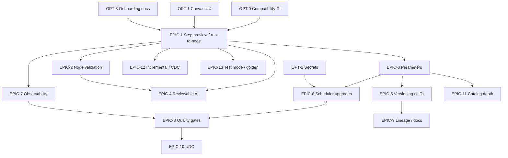

# Amphi Product Roadmap — Stories and Subtasks

| Field | Value |
|---|---|
| Source | [amphi-product-roadmap.md](./amphi-product-roadmap.md) |
| Scope | `jupyterlab-amphi`, `amphi-scheduler`, docs/examples |
| Status board | Checkboxes below (`[ ]` / `[x]`) or link to Jira/GitHub Issues |
| Labels | `roadmap`, `area:editor` / `area:manager` / `area:core` / `area:scheduler` / `area:docs` / `area:ci` |
| Priority | **P0** trust loop · **P1** productionization · **P2** platform · **OPT** existing-capability optimization |
| Last updated | 2026-08-05 |

---

## How to use this document

- **Epic**: multi-story theme aligned to a roadmap feature (`F1`–`F12`) or optimization area.
- **Story**: user- or system-facing outcome; independently demoable where possible.
- **Subtask**: concrete engineering/design work; prefer one PR-sized item per subtask.
- Packages (typical):
  - `pipeline-editor` — canvas, run controls, `.ampln` document model
  - `pipeline-components-manager` — forms, request/preview services, codegen orchestration
  - `pipeline-components-core` — operators, assert/quality components
  - `amphi-scheduler` — jobs UI + Tornado/APScheduler backend
- Non-goals from the roadmap remain out of scope unless a story explicitly reopens them.

---

## Dependency overview

**Suggested build order:** OPT-0 → EPIC-1 → EPIC-2 ∥ EPIC-3 → EPIC-6 → EPIC-7 → EPIC-4 → EPIC-8/5/9 → P2 epics.

---

# Phase P0 — Experience and trust

## EPIC-1 — Step-level data preview & run-to-node

**Roadmap:** F1 + §6.2 Execution model  
**Outcome:** Users can preview schema/sample/stats at a selected node without running the full pipeline.

---

### Story S1.1 — Preview UX shell on the canvas

**As an** analyst  
**I want** a clear Preview action on a selected node  
**So that** I can inspect intermediate data without writing outputs.

| ID | Subtask | Priority | Status | Notes |
|---|---|---|---|---|
| S1.1.1 | Design preview panel mock (schema tab, sample table, stats strip, sample vs full badge) | P0 | [ ] | Product/Design |
| S1.1.2 | Add toolbar / context-menu action `pipeline-editor:preview-node` | P0 | [ ] | `pipeline-editor` |
| S1.1.3 | Add keyboard shortcut (document in command palette) | P1 | [ ] | e.g. `Shift+Enter` on selection |
| S1.1.4 | Render dockable / bottom preview panel with loading and empty states | P0 | [ ] | |
| S1.1.5 | Show selected node id, title, engine badge (pandas/Spark) in panel header | P0 | [ ] | |
| S1.1.6 | Configurable sample size `N` (default 100) persisted in user settings or pipeline meta | P0 | [ ] | |
| S1.1.7 | Telemetry hook (optional): preview started / succeeded / failed | P2 | [ ] | Privacy-safe |

**Acceptance criteria**

- [ ] Selecting a node enables Preview; no selection shows disabled state + hint.
- [ ] Preview panel never blocks canvas editing while idle.
- [ ] Sample vs full-run labeling is always visible during/after preview.

---

### Story S1.2 — Upstream subgraph extraction

**As the** runtime  
**I want** to compute the minimal upstream DAG for a target node  
**So that** preview does not execute downstream or unrelated branches.

| ID | Subtask | Priority | Status | Notes |
|---|---|---|---|---|
| S1.2.1 | Implement `getUpstreamSubgraph(nodes, edges, targetId)` utility with cycle detection | P0 | [ ] | Shared util; unit tests |
| S1.2.2 | Topological sort of subgraph for codegen order | P0 | [ ] | |
| S1.2.3 | Exclude annotation-only / disconnected nodes | P0 | [ ] | |
| S1.2.4 | Handle multi-input nodes (join/union) — include all required parents | P0 | [ ] | |
| S1.2.5 | Surface error if target has incomplete required inputs | P0 | [ ] | Feeds EPIC-2 |
| S1.2.6 | Snapshot tests with fixture `.ampln` graphs (linear, diamond, join, spark bridge) | P0 | [ ] | |

**Acceptance criteria**

- [ ] Unit tests cover linear, fan-in, fan-out, and disconnected cases.
- [ ] Incomplete inputs fail fast with node-localized message.

---

### Story S1.3 — Preview codegen path (pandas)

**As a** pipeline author using pandas components  
**I want** preview to generate and run code only through the selected node  
**So that** I see a DataFrame sample quickly in the kernel.

| ID | Subtask | Priority | Status | Notes |
|---|---|---|---|---|
| S1.3.1 | Extend `CodeGenerator` (or sibling) with `generateThroughNode(targetId, { sampleN })` | P0 | [ ] | |
| S1.3.2 | Append sample truncation (`.head(N)` / equivalent) without mutating stored component config | P0 | [ ] | |
| S1.3.3 | Emit structured preview result payload: columns, dtypes, rows JSON, rowcount hint | P0 | [ ] | Define JSON schema |
| S1.3.4 | Execute via existing kernel request path; cancel in-flight preview on re-request | P0 | [ ] | |
| S1.3.5 | Map Python exceptions to `{ nodeId, message, traceback }` | P0 | [ ] | |
| S1.3.6 | Do not write output-side effects (file/DB writes) during preview — skip or stub output nodes if they appear as target | P0 | [ ] | Policy doc |
| S1.3.7 | Integration smoke: CSV → Filter → preview Filter | P0 | [ ] | Manual + scripted if possible |

**Acceptance criteria**

- [ ] Preview of a mid-pipeline transform does not execute downstream outputs.
- [ ] Sample table renders with correct dtypes.
- [ ] Failure highlights the responsible node on canvas.

---

### Story S1.4 — Preview codegen path (Spark / Spark Connect)

**As a** pipeline author using Spark components  
**I want** limited Spark previews (`limit` / `sample`)  
**So that** previews stay cheap on remote clusters.

| ID | Subtask | Priority | Status | Notes |
|---|---|---|---|---|
| S1.4.1 | Detect engine of target node (`spark_df_*` vs `pandas_df_*`) | P0 | [ ] | |
| S1.4.2 | For Spark targets, append `.limit(N)` (or approved sample API) before collect/toPandas for preview only | P0 | [ ] | |
| S1.4.3 | Optional: show partition / plan snippet via `explain()` truncated | P1 | [ ] | Cost guardrails |
| S1.4.4 | Session reuse: prefer shared Spark Connect session when pipeline contains session component | P0 | [ ] | Align with existing Spark session stories |
| S1.4.5 | Document preview cost warnings in UI tooltip | P1 | [ ] | |
| S1.4.6 | Smoke: SparkSqlNativeInput → SparkFilter → preview | P0 | [ ] | Needs Connect endpoint |

**Acceptance criteria**

- [ ] Spark preview never collects unbounded results by default.
- [ ] Engine badge and cost warning visible for Spark previews.

---

### Story S1.5 — In-session intermediate cache

**As an** analyst iterating on downstream nodes  
**I want** upstream preview results reused when parents are unchanged  
**So that** iteration is fast.

| ID | Subtask | Priority | Status | Notes |
|---|---|---|---|---|
| S1.5.1 | Define cache key: nodeId + config hash + upstream hashes + param values | P1 | [ ] | |
| S1.5.2 | Store last successful preview payload in editor session memory | P1 | [ ] | |
| S1.5.3 | Invalidate on node config change, edge change, or parameter change | P1 | [ ] | |
| S1.5.4 | UI control: “Refresh preview” forces bypass cache | P1 | [ ] | |
| S1.5.5 | Optional Spark temp view / cache hint for expensive parents (documented opt-in) | P2 | [ ] | |

**Acceptance criteria**

- [ ] Changing only a leaf node does not re-run unchanged parents when cache valid.
- [ ] Refresh always recomputes.

---

### Story S1.6 — Basic profiling strip

**As an** analyst  
**I want** null rates and basic column stats on preview  
**So that** I spot data issues early.

| ID | Subtask | Priority | Status | Notes |
|---|---|---|---|---|
| S1.6.1 | Compute null counts / null % on sampled frame | P1 | [ ] | Sample-aware labeling |
| S1.6.2 | For numeric columns: min/max/mean on sample (optional toggle) | P2 | [ ] | |
| S1.6.3 | Render stats strip under sample table | P1 | [ ] | |
| S1.6.4 | Performance budget: skip heavy stats if columns > threshold | P1 | [ ] | |

**Acceptance criteria**

- [ ] Stats clearly marked as “on sample” when applicable.

---

## EPIC-2 — Node-level validation and error localization

**Roadmap:** F2  
**Outcome:** Config and wiring problems appear on the canvas before or during run; logs deep-link to nodes.

---

### Story S2.1 — Static graph validation

**As a** pipeline author  
**I want** invalid nodes marked before I run  
**So that** I fix wiring/config early.

| ID | Subtask | Priority | Status | Notes |
|---|---|---|---|---|
| S2.1.1 | Inventory required fields per component type (or declare `required` in form schema) | P0 | [ ] | |
| S2.1.2 | Validate disconnected required input handles | P0 | [ ] | |
| S2.1.3 | Validate engine port compatibility (pandas edge into spark handle → warning + bridge suggestion) | P0 | [ ] | |
| S2.1.4 | Join key presence warnings when keys configured but missing from known schema (best-effort) | P1 | [ ] | Needs schema from preview/cache |
| S2.1.5 | Canvas overlays: error/warning icons + tooltip list | P0 | [ ] | |
| S2.1.6 | Problems panel listing all issues with click-to-select | P0 | [ ] | |
| S2.1.7 | Run/Preview blocked or confirmed when P0 errors exist (product decision) | P0 | [ ] | Document policy |

**Acceptance criteria**

- [ ] Missing required connection shows node-level error within 1s of graph change.
- [ ] Clicking a problem selects the node and opens its form if applicable.

---

### Story S2.2 — Runtime error → node mapping

**As a** pipeline author  
**I want** execution failures to select the failing node  
**So that** debugging does not require reading raw stack traces alone.

| ID | Subtask | Priority | Status | Notes |
|---|---|---|---|---|
| S2.2.1 | Inject node markers / comments in generated code (`# amphi:node=<id>`) | P0 | [ ] | |
| S2.2.2 | Parse kernel traceback / stdout for markers | P0 | [ ] | |
| S2.2.3 | Fallback: map by generated variable names if markers stripped | P1 | [ ] | |
| S2.2.4 | Console / log line click handler → `selectNode(id)` | P0 | [ ] | |
| S2.2.5 | Persist last error on node until successful re-run | P1 | [ ] | |

**Acceptance criteria**

- [ ] Deliberate Filter syntax error selects Filter node from console click.
- [ ] Marker comments do not change runtime semantics.

---

## EPIC-3 — Pipeline parameters

**Roadmap:** F3  
**Outcome:** Named parameters in `.ampln`, used in forms/codegen, overridable at run/schedule time.

---

### Story S3.1 — Parameter model in `.ampln`

**As a** data engineer  
**I want** to declare named parameters on a pipeline  
**So that** I avoid hardcoding environment-specific values.

| ID | Subtask | Priority | Status | Notes |
|---|---|---|---|---|
| S3.1.1 | Spec: parameter object `{ name, type, default, description, secret? }` | P0 | [ ] | Design doc section |
| S3.1.2 | Persist `pipeline.parameters[]` in `.ampln` JSON | P0 | [ ] | Stable key order (see EPIC-5) |
| S3.1.3 | Migration: pipelines without parameters load as `[]` | P0 | [ ] | |
| S3.1.4 | Parameters tab UI: add/edit/delete/reorder | P0 | [ ] | |
| S3.1.5 | Validation: unique names, valid identifiers, type-compatible defaults | P0 | [ ] | |
| S3.1.6 | Unit tests for load/save round-trip | P0 | [ ] | |

**Acceptance criteria**

- [ ] Saving/reopening pipeline preserves parameters.
- [ ] Invalid names blocked with inline errors.

---

### Story S3.2 — Form interpolation UX

**As a** pipeline author  
**I want** to reference `${param}` in component fields  
**So that** one definition drives many nodes.

| ID | Subtask | Priority | Status | Notes |
|---|---|---|---|---|
| S3.2.1 | Define interpolation syntax (`${name}`) and escape rules | P0 | [ ] | Doc |
| S3.2.2 | Autocomplete param names in eligible string/number fields | P0 | [ ] | Manager forms |
| S3.2.3 | Visual chip/badge when a field contains param refs | P1 | [ ] | |
| S3.2.4 | Resolve defaults for live form “resolved preview” (optional toggle) | P1 | [ ] | |
| S3.2.5 | Reject unknown param references in static validation | P0 | [ ] | EPIC-2 integration |

**Acceptance criteria**

- [ ] User can insert `${as_of_date}` into a path field via autocomplete.
- [ ] Unknown `${foo}` appears as validation error.

---

### Story S3.3 — Codegen emits variables (not only substituted literals)

**As a** reviewer of generated Python  
**I want** parameters as Python variables / dict  
**So that** scheduled overrides and portability remain clear.

| ID | Subtask | Priority | Status | Notes |
|---|---|---|---|---|
| S3.3.1 | Emit preamble `amphi_params = { ... }` (or CLI/env merge) | P0 | [ ] | |
| S3.3.2 | Substitute field refs to `amphi_params["name"]` in generated expressions | P0 | [ ] | |
| S3.3.3 | Type coercion helpers (int/float/bool/str) | P0 | [ ] | |
| S3.3.4 | Secret params read from env / secret store refs (coordinate OPT-2) | P1 | [ ] | |
| S3.3.5 | Offline codegen tests with fixture pipeline | P0 | [ ] | |
| S3.3.6 | Document pattern in user guide | P1 | [ ] | |

**Acceptance criteria**

- [ ] Generated code shows parameter dict; changing default in UI changes preamble.
- [ ] Full pipeline run with defaults succeeds for sample pipeline.

---

### Story S3.4 — Run-time and schedule overrides

**As an** operator  
**I want** to override parameters when running or scheduling  
**So that** one pipeline serves backfills and multiple environments.

| ID | Subtask | Priority | Status | Notes |
|---|---|---|---|---|
| S3.4.1 | “Run with parameters” dialog in editor | P0 | [ ] | |
| S3.4.2 | Pass overrides into codegen/kernel execution | P0 | [ ] | |
| S3.4.3 | Scheduler job schema: `parameter_overrides` map | P0 | [ ] | Depends EPIC-6 |
| S3.4.4 | Scheduler JobForm UI for overrides | P0 | [ ] | |
| S3.4.5 | Record effective params on each run record | P1 | [ ] | Observability |

**Acceptance criteria**

- [ ] Same `.ampln` scheduled twice with different `env` overrides produces different effective paths.
- [ ] Run history shows effective parameter values.

---

## EPIC-4 — Reviewable AI assistance

**Roadmap:** F4  
**Depends on:** EPIC-1 (preview), EPIC-2 (validation) strongly recommended  
**Outcome:** NL prompts propose Amphi operators; users review/apply; no unconstrained script dumps as default.

---

### Story S4.1 — Constrained proposal schema

**As a** platform  
**I want** AI outputs constrained to known component ids + configs  
**So that** proposals remain maintainable.

| ID | Subtask | Priority | Status | Notes |
|---|---|---|---|---|
| S4.1.1 | Publish machine-readable component catalog (id, ports, form schema, engine) | P0 | [ ] | Generated from registry |
| S4.1.2 | Define proposal JSON schema: nodes[], edges[], summary | P0 | [ ] | |
| S4.1.3 | Validator rejects unknown component ids / invalid configs | P0 | [ ] | |
| S4.1.4 | Allowlisted “CustomTransform” escape hatch only when user opts in | P1 | [ ] | Non-goal: unconstrained multi-file |

**Acceptance criteria**

- [ ] Invalid proposals never mutate the canvas.

---

### Story S4.2 — AI panel UX (review before apply)

**As a** reviewer  
**I want** to inspect proposed operators and reject/apply  
**So that** I stay in control.

| ID | Subtask | Priority | Status | Notes |
|---|---|---|---|---|
| S4.2.1 | Design AI side panel: prompt, proposal list, diff vs canvas | P0 | [ ] | |
| S4.2.2 | Command `pipeline-editor:ai-assist` | P0 | [ ] | |
| S4.2.3 | Render proposed nodes as read-only preview graph or checklist | P0 | [ ] | |
| S4.2.4 | Apply merges into canvas with undo stack entry | P0 | [ ] | |
| S4.2.5 | “Preview proposed subgraph” using EPIC-1 after apply or dry-run | P1 | [ ] | |
| S4.2.6 | Optional editable one-line description per node | P2 | [ ] | Designer-like |

**Acceptance criteria**

- [ ] User can dismiss a proposal with zero canvas changes.
- [ ] Apply is a single undoable transaction.

---

### Story S4.3 — Model/provider integration

**As an** admin  
**I want** configurable LLM endpoint / API key via env  
**So that** AI works in enterprise networks.

| ID | Subtask | Priority | Status | Notes |
|---|---|---|---|---|
| S4.3.1 | Settings: provider, base URL, model, API key env var name | P0 | [ ] | No key in `.ampln` |
| S4.3.2 | Server or browser proxy policy (prefer server-side) | P0 | [ ] | Security review |
| S4.3.3 | Prompt template includes catalog + current graph summary | P0 | [ ] | |
| S4.3.4 | Rate limit / timeout / error UX | P1 | [ ] | |
| S4.3.5 | Offline/dev mock provider returning fixture proposals | P0 | [ ] | For CI |

**Acceptance criteria**

- [ ] CI can run proposal validation without external LLM.
- [ ] Secrets never written into pipeline JSON.

---

# Phase P1 — Productionization

## EPIC-5 — Versioning and collaboration

**Roadmap:** F5

---

### Story S5.1 — Git-friendly `.ampln`

**As a** teammate using Git  
**I want** stable, minimal diffs for pipeline files  
**So that** reviews are readable.

| ID | Subtask | Priority | Status | Notes |
|---|---|---|---|---|
| S5.1.1 | Canonical JSON key ordering for nodes/edges/config | P1 | [ ] | |
| S5.1.2 | Avoid rewriting volatile fields (timestamps, viewport) unless changed | P1 | [ ] | |
| S5.1.3 | Normalize floating positions precision | P2 | [ ] | |
| S5.1.4 | Document `.gitattributes` / pretty-diff tips | P1 | [ ] | |
| S5.1.5 | Fixture test: round-trip produces byte-stable output for unchanged graph | P1 | [ ] | |

**Acceptance criteria**

- [ ] Opening and saving without edits produces no Git diff (or only documented exceptions).

---

### Story S5.2 — Structural diff view

**As a** reviewer  
**I want** a graph/config diff between two versions  
**So that** I understand pipeline changes quickly.

| ID | Subtask | Priority | Status | Notes |
|---|---|---|---|---|
| S5.2.1 | Diff algorithm: added/removed/modified nodes and edges | P1 | [ ] | |
| S5.2.2 | Field-level config diff for modified nodes | P1 | [ ] | |
| S5.2.3 | UI: side-by-side or unified diff panel (file vs file / vs Git) | P2 | [ ] | |
| S5.2.4 | Optional export of generated `.py` with header policy | P2 | [ ] | |

**Acceptance criteria**

- [ ] Adding one Filter shows a single node-add in structural diff.

---

## EPIC-6 — Scheduler upgrades

**Roadmap:** F6  
**Package:** `amphi-scheduler`  
**Depends on:** EPIC-3 for parameter overrides

---

### Story S6.1 — Discoverability (Launcher + menu)

**As a** JupyterLab user  
**I want** to find Pipeline Scheduler from Launcher/menu  
**So that** I do not rely only on the auto sidebar.

| ID | Subtask | Priority | Status | Notes |
|---|---|---|---|---|
| S6.1.1 | Register Launcher tile under Amphi / Other | P1 | [ ] | Mirror pipeline-editor pattern |
| S6.1.2 | Add Main Menu → Amphi → Pipeline Scheduler | P1 | [ ] | |
| S6.1.3 | Keep command palette entry; stop forcing auto-open if user closed (settings) | P1 | [ ] | UX decision |
| S6.1.4 | Update [amphi-scheduler-user-guide.md](./amphi-scheduler-user-guide.md) | P1 | [ ] | Currently incomplete in tree |

**Acceptance criteria**

- [ ] Fresh user can open Scheduler without knowing the command id.

---

### Story S6.2 — Fresh codegen at run time

**As an** operator  
**I want** scheduled `.ampln` jobs to run latest pipeline logic  
**So that** schedules do not drift from stale `python_code` snapshots.

| ID | Subtask | Priority | Status | Notes |
|---|---|---|---|---|
| S6.2.1 | Job option: `codegen_mode = snapshot \| fresh` (default fresh for new jobs) | P1 | [ ] | |
| S6.2.2 | Backend: read `.ampln` from contents path at run | P1 | [ ] | |
| S6.2.3 | Invoke shared codegen (Python port or call into installed amphi APIs) | P1 | [ ] | Architecture spike first |
| S6.2.4 | Fallback to snapshot if file missing; mark run warning | P1 | [ ] | |
| S6.2.5 | Store content checksum on job; warn UI when file changed | P1 | [ ] | |
| S6.2.6 | Tests: edit ampln between runs → fresh mode picks up change | P1 | [ ] | |

**Acceptance criteria**

- [ ] With `fresh`, editing Filter then waiting for schedule changes results without editing the job.
- [ ] Snapshot mode remains available for pinned reproductions.

---

### Story S6.3 — Retries, timeouts, misfire policies in UI

**As an** operator  
**I want** to configure reliability policies  
**So that** transient failures do not page humans unnecessarily.

| ID | Subtask | Priority | Status | Notes |
|---|---|---|---|---|
| S6.3.1 | Expose `max_instances`, `coalesce`, `misfire_grace_time` in JobForm (already backend defaults) | P1 | [ ] | |
| S6.3.2 | Add `timeout_seconds` enforced on subprocess | P1 | [ ] | |
| S6.3.3 | Add `retry_count` / `retry_backoff_seconds` | P1 | [ ] | |
| S6.3.4 | Persist and show last failure reason on Tasks list | P1 | [ ] | |
| S6.3.5 | Docs + examples for cron misfire behavior | P1 | [ ] | |

**Acceptance criteria**

- [ ] User-visible fields round-trip to APScheduler job store.
- [ ] Timed-out run marked failed with clear message.

---

### Story S6.4 — Failure alerts

**As an** on-call engineer  
**I want** webhook/email on job failure  
**So that** I know without watching the Monitoring tab.

| ID | Subtask | Priority | Status | Notes |
|---|---|---|---|---|
| S6.4.1 | Spec alert channels: webhook POST, optional SMTP | P1 | [ ] | |
| S6.4.2 | Per-job and global default alert settings | P1 | [ ] | |
| S6.4.3 | Payload includes job id, name, run id, error snippet, effective params | P1 | [ ] | |
| S6.4.4 | Secret-safe webhook URL storage | P1 | [ ] | OPT-2 |
| S6.4.5 | Test alert button | P2 | [ ] | |

**Acceptance criteria**

- [ ] Failed run triggers configured webhook once (no spam loops).

---

### Story S6.5 — Export to external schedulers

**As a** platform engineer  
**I want** to export a job definition to Airflow/cron  
**So that** production can leave local APScheduler when needed.

| ID | Subtask | Priority | Status | Notes |
|---|---|---|---|---|
| S6.5.1 | Export cron line + wrapper script for `.ampln`/`.py` | P2 | [ ] | |
| S6.5.2 | Export Airflow DAG stub (BashOperator / PythonOperator) | P2 | [ ] | |
| S6.5.3 | Document limitations (no Unity Catalog parity — non-goal) | P2 | [ ] | |

**Acceptance criteria**

- [ ] Exported artifacts run a sample pipeline outside Amphi scheduler with documented prerequisites.

---

## EPIC-7 — Observability timeline

**Roadmap:** §6.3 + supports F6/F8

---

### Story S7.1 — Unified run timeline in editor

**As a** pipeline author  
**I want** per-node duration and row counts  
**So that** I find bottlenecks.

| ID | Subtask | Priority | Status | Notes |
|---|---|---|---|---|
| S7.1.1 | Instrument codegen with timing wrappers per node marker | P1 | [ ] | |
| S7.1.2 | Collect rows in/out where cheap (`len(df)` / Spark count optional/expensive toggle) | P1 | [ ] | |
| S7.1.3 | Timeline UI panel synchronized with canvas highlight | P1 | [ ] | |
| S7.1.4 | Spark: optional stage summary from recent job (best-effort) | P2 | [ ] | |

**Acceptance criteria**

- [ ] After a full run, each executed node shows duration in timeline.

---

### Story S7.2 — Scheduler run artifacts deep link

**As an** operator  
**I want** logs linked to node ids when available  
**So that** scheduled failures debug like interactive runs.

| ID | Subtask | Priority | Status | Notes |
|---|---|---|---|---|
| S7.2.1 | Persist structured run log path under `.amphi/runs/` | P1 | [ ] | |
| S7.2.2 | Parse markers in scheduler stdout | P1 | [ ] | |
| S7.2.3 | Monitoring UI: “Open node” opens `.ampln` + selects node when path known | P2 | [ ] | |

---

## EPIC-8 — Data quality gates

**Roadmap:** F8

---

### Story S8.1 — Assert components (pandas + Spark)

**As a** data engineer  
**I want** assert nodes for row counts / uniqueness / non-null  
**So that** bad data fails before expensive writes.

| ID | Subtask | Priority | Status | Notes |
|---|---|---|---|---|
| S8.1.1 | `DataQualityAssert` pandas component: row count min/max, unique cols, non-null cols | P1 | [ ] | |
| S8.1.2 | Spark equivalent or engine-aware single component | P1 | [ ] | |
| S8.1.3 | Modes: `fail` vs `warn` | P1 | [ ] | |
| S8.1.4 | Codegen raises actionable exception message | P1 | [ ] | |
| S8.1.5 | Palette placement under Transforms → Quality | P1 | [ ] | |
| S8.1.6 | Sample pipeline + docs | P1 | [ ] | |
| S8.1.7 | Optional GE wrapper component (post-MVP) | P2 | [ ] | |

**Acceptance criteria**

- [ ] Assert failure stops pipeline before downstream File Output in sample.

---

## EPIC-9 — Lineage and documentation

**Roadmap:** F7

---

### Story S9.1 — Column lineage sketch

| ID | Subtask | Priority | Status | Notes |
|---|---|---|---|---|
| S9.1.1 | Infer column flow for rename/select/drop/join where possible | P2 | [ ] | Best-effort |
| S9.1.2 | Lineage panel UI for selected column | P2 | [ ] | |
| S9.1.3 | Document unsupported cases | P2 | [ ] | |

---

### Story S9.2 — Auto README / operator descriptions

| ID | Subtask | Priority | Status | Notes |
|---|---|---|---|---|
| S9.2.1 | Generate markdown summary from graph + annotations | P2 | [ ] | |
| S9.2.2 | Per-node description field (manual) | P1 | [ ] | Cheap win |
| S9.2.3 | Optional AI fill of descriptions (EPIC-4) | P2 | [ ] | |

---

# Phase P2 — Platform and ecosystem

## EPIC-10 — User-defined operators (UDO)

**Roadmap:** F9

---

### Story S10.1 — UDO package format

| ID | Subtask | Priority | Status | Notes |
|---|---|---|---|---|
| S10.1.1 | Spec: form schema + codegen template + metadata + icon | P2 | [ ] | |
| S10.1.2 | Loader discovers UDOs from `.amphi/components/` | P2 | [ ] | Scheduler already touches components dir |
| S10.1.3 | Validate UDO on load; sandbox guidance | P2 | [ ] | Security |
| S10.1.4 | Devtools: “Export node as UDO” scaffold | P2 | [ ] | |
| S10.1.5 | Example UDO + docs | P2 | [ ] | |

---

## EPIC-11 — Deeper catalog & connection registry

**Roadmap:** F10

---

### Story S11.1 — Shared connection registry

| ID | Subtask | Priority | Status | Notes |
|---|---|---|---|---|
| S11.1.1 | Design connection objects with secret refs (no raw secrets in graph) | P2 | [ ] | OPT-2 |
| S11.1.2 | UI to manage named connections | P2 | [ ] | |
| S11.1.3 | Components select connection by name | P2 | [ ] | |
| S11.1.4 | Migrate Spark/DB forms to optional registry | P2 | [ ] | |

---

### Story S11.2 — Catalog search & favorites

| ID | Subtask | Priority | Status | Notes |
|---|---|---|---|---|
| S11.2.1 | Search tables across cached catalogs | P2 | [ ] | Build on spark catalog cache |
| S11.2.2 | Favorites / recent tables | P2 | [ ] | |
| S11.2.3 | Partition column hints when available | P2 | [ ] | |
| S11.2.4 | Permission-denied messaging (friendly) | P2 | [ ] | |

---

## EPIC-12 — Incremental / CDC / watermarks

**Roadmap:** F11

---

### Story S12.1 — Incremental file ingest patterns

| ID | Subtask | Priority | Status | Notes |
|---|---|---|---|---|
| S12.1.1 | Design watermark state store (file/sqlite) | P2 | [ ] | |
| S12.1.2 | Component: IncrementalFileInput (pandas) | P2 | [ ] | |
| S12.1.3 | Component: Spark incremental read options / CDF where applicable | P2 | [ ] | |
| S12.1.4 | Runbook + sample pipelines | P2 | [ ] | |

---

## EPIC-13 — Test mode and golden outputs

**Roadmap:** F12  
**Depends on:** EPIC-1

---

### Story S13.1 — Deterministic preview / test run

| ID | Subtask | Priority | Status | Notes |
|---|---|---|---|---|
| S13.1.1 | Test mode flag: fixed sample seed / max rows | P2 | [ ] | |
| S13.1.2 | Store golden sample JSON beside `.ampln` | P2 | [ ] | |
| S13.1.3 | Compare command + CI-friendly CLI exit codes | P2 | [ ] | |
| S13.1.4 | Docs for “Test pipeline” workflow | P2 | [ ] | |

---

# Phase OPT — Optimize existing capabilities

## OPT-0 — Compatibility & packaging CI

**Roadmap:** §6.5

| ID | Subtask | Priority | Status | Notes |
|---|---|---|---|---|
| OPT-0.1 | CI matrix job: JupyterLab 4.4.x, 4.5.x, 4.6.x | P0 | [ ] | `labextension list` must OK for `@amphi/*` |
| OPT-0.2 | Assert `@jupyter/ydoc` range `^3 \|\| ^4` remains in built metadata | P0 | [ ] | |
| OPT-0.3 | Assert scheduler `react-dom` `^18` | P0 | [ ] | Regression lock |
| OPT-0.4 | Document Elyra factory-name collision mitigation | P1 | [ ] | examples/README |
| OPT-0.5 | Keep `jupyterlab>=4.4.0,<5` pins aligned across amphi + scheduler | P0 | [ ] | Already started |

---

## OPT-1 — Canvas UX & discoverability

**Roadmap:** §6.1

---

### Story OPT-1.1 — Palette search, tags, engine filter

| ID | Subtask | Priority | Status | Notes |
|---|---|---|---|---|
| OPT-1.1.1 | Engine filter chips: Pandas / Spark / I/O / All | P1 | [ ] | |
| OPT-1.1.2 | Improve fuzzy search across name, id, description, tags | P1 | [ ] | |
| OPT-1.1.3 | Tag components in registry metadata | P1 | [ ] | |
| OPT-1.1.4 | “Recommended next” based on selected node output type | P2 | [ ] | |
| OPT-1.1.5 | Engine badge on canvas nodes | P1 | [ ] | |

---

### Story OPT-1.2 — Bridge suggestions

| ID | Subtask | Priority | Status | Notes |
|---|---|---|---|---|
| OPT-1.2.1 | Detect pandas→spark illegal edge; offer insert Spark bridge | P1 | [ ] | |
| OPT-1.2.2 | One-click insert `PandasToSpark` / `SparkToPandas` | P1 | [ ] | |

---

### Story OPT-1.3 — Template gallery & first-run wizard

| ID | Subtask | Priority | Status | Notes |
|---|---|---|---|---|
| OPT-1.3.1 | Gallery UI listing sample `.ampln` from `examples/pipelines` | P1 | [ ] | |
| OPT-1.3.2 | Wizard: CSV → clean → export guided path | P2 | [ ] | |
| OPT-1.3.3 | Empty canvas CTA linking to gallery | P1 | [ ] | |

---

## OPT-2 — Secrets & audit

**Roadmap:** §6.4

| ID | Subtask | Priority | Status | Notes |
|---|---|---|---|---|
| OPT-2.1 | Spec secret reference syntax (`env:NAME`, `secret:NAME`) | P1 | [ ] | |
| OPT-2.2 | Redact secrets in logs and exported JSON | P1 | [ ] | |
| OPT-2.3 | Migrate password form fields to prefer refs | P1 | [ ] | |
| OPT-2.4 | Optional audit log of runs + connection name usage | P2 | [ ] | |
| OPT-2.5 | Security review checklist for AI proxy + scheduler webhooks | P1 | [ ] | |

---

## OPT-3 — Documentation & onboarding

**Roadmap:** §6.6

| ID | Subtask | Priority | Status | Notes |
|---|---|---|---|---|
| OPT-3.1 | Complete [amphi-scheduler-user-guide.md](./amphi-scheduler-user-guide.md) | P1 | [ ] | |
| OPT-3.2 | Getting started guide linking roadmap features as they ship | P1 | [ ] | |
| OPT-3.3 | Expand Spark Connect runbook with preview/params sections when ready | P1 | [ ] | |
| OPT-3.4 | CHANGELOG entries per epic ship | P1 | [ ] | Ongoing |
| OPT-3.5 | Cross-link this stories file from roadmap §14 history | P0 | [ ] | |

---

## OPT-4 — Form defaults & connection reuse

**Roadmap:** §6.1 complex forms

| ID | Subtask | Priority | Status | Notes |
|---|---|---|---|---|
| OPT-4.1 | Audit top 20 components for missing sensible defaults | P2 | [ ] | |
| OPT-4.2 | Reuse last Retrieve catalog cache across components (extend existing cache) | P1 | [ ] | Partially done |
| OPT-4.3 | Shared “pick connection” control once registry exists | P2 | [ ] | EPIC-11 |

---

# Tracking boards (optional rollup)

## P0 launch checklist

- [ ] EPIC-1 Stories S1.1–S1.4 (preview MVP)
- [ ] EPIC-2 Stories S2.1–S2.2
- [ ] EPIC-3 Stories S3.1–S3.4
- [ ] OPT-0 CI matrix green
- [ ] EPIC-4 can start after preview+validation demos

## P1 production checklist

- [ ] EPIC-6 S6.1–S6.4
- [ ] EPIC-7 S7.1
- [ ] EPIC-8 S8.1
- [ ] EPIC-5 S5.1
- [ ] OPT-1 + OPT-2 + OPT-3 foundational items

## P2 platform checklist

- [ ] EPIC-10 / 11 / 12 / 13 MVPs
- [ ] EPIC-9 lineage sketch

---

## Metrics instrumentation stories

| ID | Subtask | Priority | Status | Notes |
|---|---|---|---|---|
| M.1 | Define event schema for preview success/failure latency | P1 | [ ] | Roadmap §8 |
| M.2 | Track % failures with nodeId present | P1 | [ ] | |
| M.3 | Track pipelines with parameters + scheduled overrides | P1 | [ ] | |
| M.4 | Dashboard or weekly log of scheduler success rate | P2 | [ ] | |

---

## Appendix — Story ID index

| ID prefix | Epic |
|---|---|
| S1.* | Step preview / run-to-node |
| S2.* | Node validation / error localization |
| S3.* | Parameters |
| S4.* | Reviewable AI |
| S5.* | Versioning / Git |
| S6.* | Scheduler upgrades |
| S7.* | Observability |
| S8.* | Data quality |
| S9.* | Lineage / docs generation |
| S10.* | UDO |
| S11.* | Catalog / connections |
| S12.* | Incremental / CDC |
| S13.* | Test mode / golden |
| OPT-* | Optimizations |
| M.* | Metrics |

---

## Document history

| Date | Change |
|---|---|
| 2026-08-05 | Initial stories/subtasks derived from [amphi-product-roadmap.md](./amphi-product-roadmap.md) |
