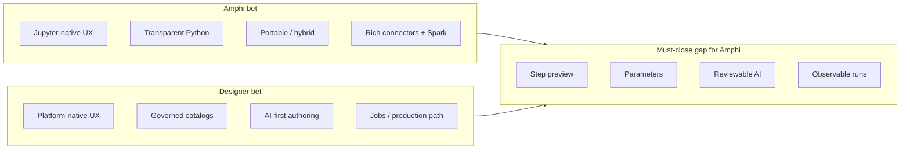
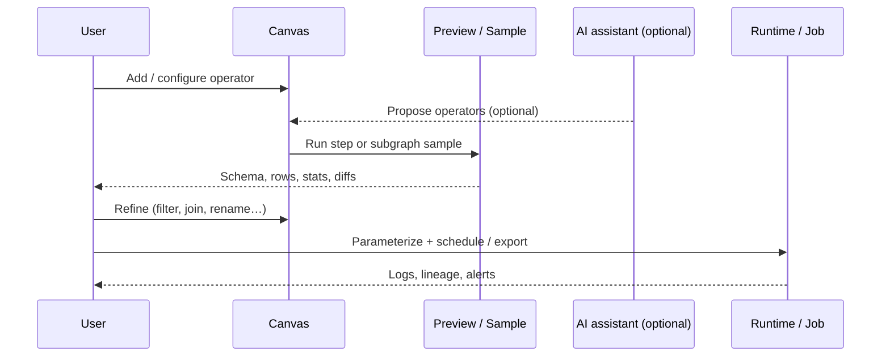
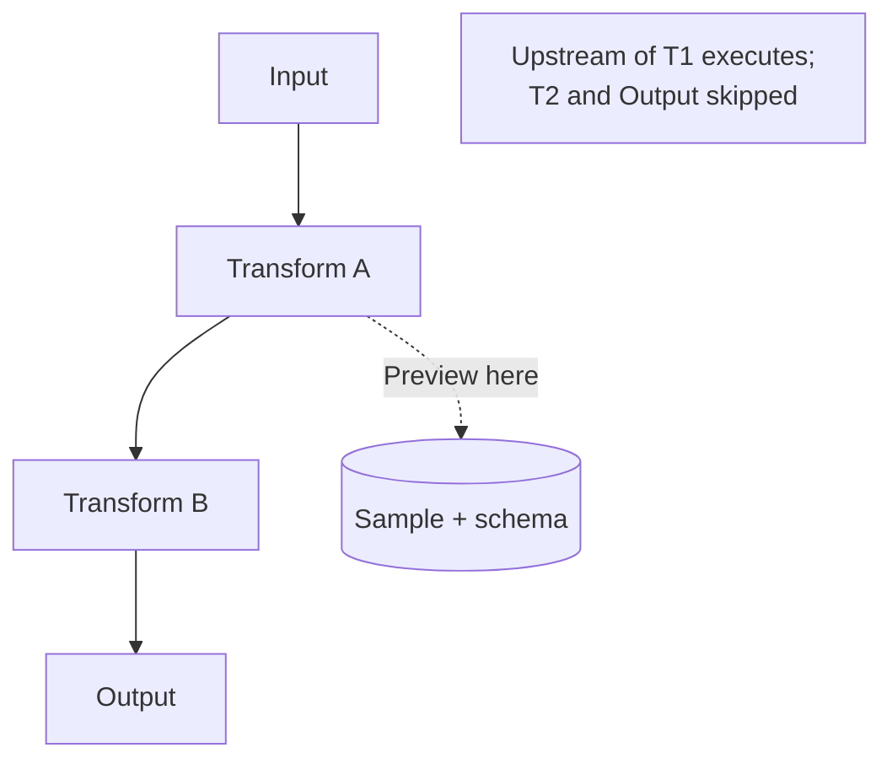
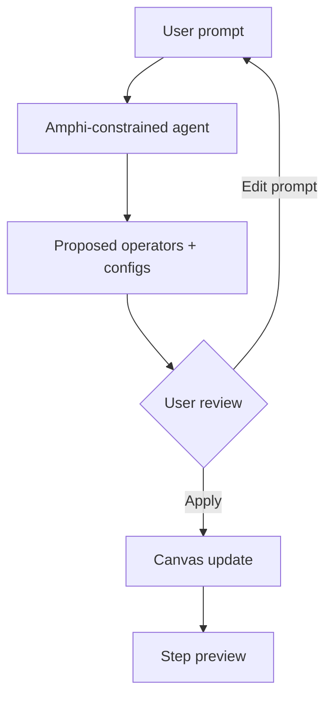
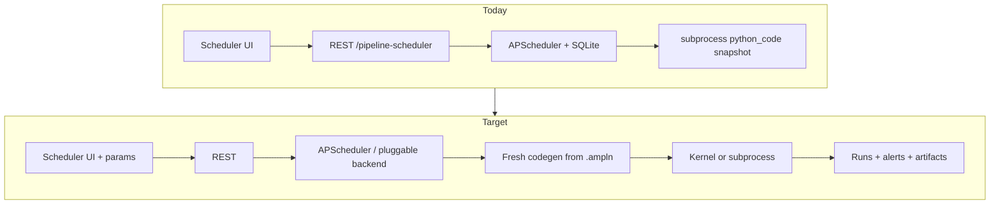
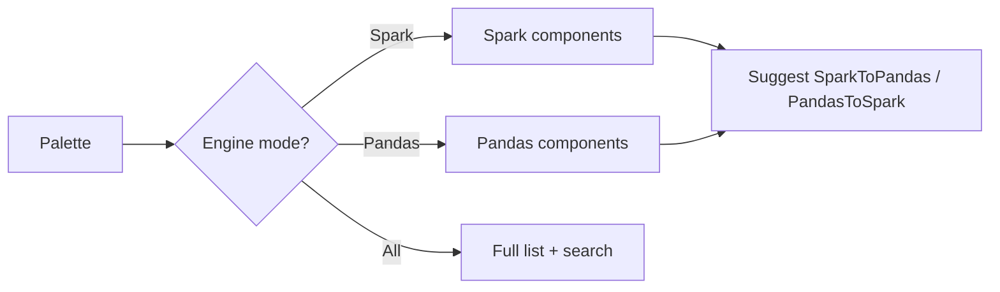
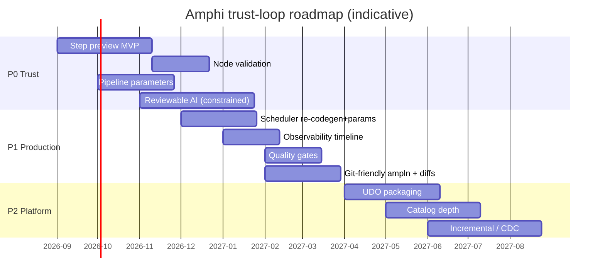
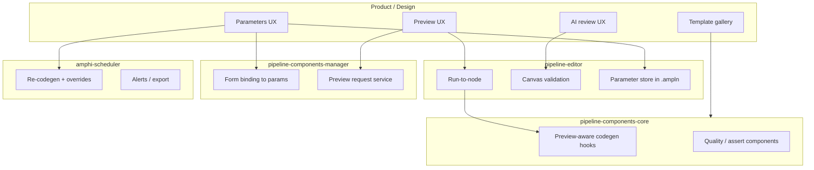

# Amphi Product Roadmap

**Audience:** product, engineering, and design  
**Scope:** `jupyterlab-amphi`, `amphi-scheduler`, and related docs/examples  
**Review date:** 2026-08-05  
**Related:** [amphi-product-roadmap-stories.md](./amphi-product-roadmap-stories.md) (stories & subtasks) · [examples/README.md](../examples/README.md) (JupyterLab compatibility) · [spark-sql-input-design.md](./spark-sql-input-design.md) · [amphi-scheduler-user-guide.md](./amphi-scheduler-user-guide.md)

---

## 1. Executive summary

Amphi is a **Jupyter-native visual ETL** product: users compose pipelines on a canvas, Amphi generates transparent Python (pandas / Spark / connectors), and pipelines run in the Lab kernel or via `amphi-scheduler`.

Databricks **Lakeflow Designer** (Visual Data Prep) is a **platform-native visual data prep** experience: drag-and-drop operators, AI-first authoring (Genie Code), step-by-step previews, Unity Catalog governance, and a direct path into Lakeflow Jobs / production without rewriting logic.

Amphi should **not** try to out-govern Databricks inside Databricks. The winning posture is:

> **Jupyter-native Visual Prep** — code-transparent, portable, hybrid/local-friendly — with **step previews, parameters, reviewable AI, and reliable scheduling** so pipelines are trustworthy and shippable.

This document turns that posture into a prioritized roadmap: features to add, areas to optimize, sequencing, and measurable outcomes.

---

## 2. Positioning

### 2.1 Comparison at a glance

| Dimension | Amphi (`jupyterlab-amphi`) | Databricks Lakeflow Designer |
|-----------|----------------------------|------------------------------|
| Home surface | JupyterLab / local or remote kernels | Databricks workspace |
| Primary artifact | `.ampln` → generated Python | Visual data prep → production-ready platform code |
| Execution | Kernel / subprocess / Spark Connect | Lakeflow / Databricks compute |
| Governance | Workspace files, env vars, optional secrets | Unity Catalog, lineage, permissions |
| AI | Optional / not first-class yet | Genie Code, schema- and lineage-aware |
| Preview model | Mostly full-pipeline run | Per-operator interim preview |
| Portability | High (plain Python) | High *inside* Databricks; low outside |
| Scheduler | `amphi-scheduler` (APScheduler + SQLite) | Lakeflow Jobs / platform scheduling |

### 2.2 Strategic framing



**Keep:** code transparency, connector breadth, Spark Connect family, Jupyter integration.  
**Close:** Designer-class *trust loop* (see → change → validate → ship).  
**Defer / partner:** enterprise catalog governance comparable to Unity Catalog.

---

## 3. Current strengths (do not regress)

Amphi already has material advantages that the roadmap must preserve:

1. **Real code output** — pandas / Spark / editable Python that can run outside Amphi.
2. **Broad I/O** — files, databases, cloud/object storage, REST, lakehouse (e.g. Trino), Spark Connect.
3. **Dense transform library** — including a large Spark operator set (SQL input/transform, file/table I/O, bridges, joins, reshape, string/date/math helpers, etc.).
4. **JupyterLab embedding** — file type `.ampln`, launcher/palette integration, kernel execution, metadata/console panels.
5. **Scheduling extension** — `amphi-scheduler` with date / interval / cron / trigger jobs and run monitoring.

Roadmap items that break portability or hide generated code behind a black box are out of scope unless explicitly accepted as product trade-offs.

---

## 4. Industry reference: Visual Data Prep trust loop

Lakeflow Designer and peers (Power Query, Alteryx, some dbt Cloud visual flows) converge on the same user loop:



**Implication for Amphi:** shipping more operators without this loop yields diminishing returns. Preview, parameters, and observability are higher leverage than the next string function.

---

## 5. Feature additions (prioritized)

### 5.1 P0 — Experience and trust (largest gap vs Visual Data Prep)

#### F1. Step-level data preview

**Problem:** Users often must run the whole pipeline before seeing intermediate results.  
**Goal:** Preview schema, sample rows, row counts, and basic null/profile stats **per selected node** without a full production run.

**Acceptance criteria (draft):**
- Select a node → “Preview” runs upstream subgraph only (or cached intermediates).
- Show column types, sample table (configurable *N* rows), approximate row count when cheap.
- Clear indication of sample vs full run; Spark paths use limit / sample APIs where possible.
- Errors surface on the failing node, not only in a global console.



#### F2. Node-level validation and error localization

**Problem:** Misconfigured joins, types, and missing connections fail late and anonymously.  
**Goal:** Static + lightweight runtime checks on the canvas.

**Examples:**
- Missing required fields / disconnected handles.
- Join key type mismatch warnings.
- Spark vs pandas port incompatibility (suggest bridge).
- Click-through from log line → node selection.

#### F3. Pipeline parameters

**Problem:** Paths, dates, limits, and environments are hard-coded in forms.  
**Goal:** Named parameters referenced by components and overridable at schedule time (Designer parity).

**Model sketch:**

```mermaid
flowchart LR
  subgraph Def["Pipeline definition"]
    P[Parameters tab<br/>env, as_of_date, max_rows]
  end

  subgraph Graph["Components"]
    C1[File Input path = ${env}/raw/…]
    C2[Spark SQL limit = ${max_rows}]
  end

  subgraph Run["Run / Schedule"]
    R1[Default values]
    R2[Override per job]
  end

  Def --> Graph
  Def --> Run
```

**Acceptance criteria (draft):**
- Parameters panel on the pipeline document.
- Interpolation in string/number fields (and codegen emits variables, not only substituted literals).
- Scheduler UI can override parameters per job / per run.

#### F4. Reviewable AI assistance

**Problem:** Unconstrained “generate a script” AI produces unmaintainable pipelines.  
**Goal:** Natural language that inserts/edits **Amphi operators**, with preview and diff.

**Principles:**
- AI proposes a subgraph of known components, not opaque code blocks (except explicit Custom nodes).
- User reviews operator list + configs before apply.
- Optional: AI-generated one-line description on each node (editable), similar to Designer operator descriptions.



---

### 5.2 P1 — Productionization

#### F5. Versioning and collaboration

- Git-friendly `.ampln` (stable key order, minimal noise).
- Optional paired export of generated `.py` with clear “generated / do not edit” or dual-edit policy.
- Diff view: graph structural diff + config field diff.

#### F6. Scheduler upgrades (`amphi-scheduler`)

Current baseline: sidebar panel, date/interval/cron/trigger, SQLite store, snapshot `python_code` for `.ampln`.

**Upgrades:**
- Re-codegen from `.ampln` at run time (or checksum + refresh) so schedules do not drift from the file.
- Parameter injection at run time.
- Retries, timeouts, misfire policies exposed in UI.
- Webhooks / email alerts on failure.
- Export to Airflow / cron / external job definitions.
- Discoverability: Launcher tile + main menu entry (today: palette + auto sidebar only).



#### F7. Lineage and documentation

- Column-level lineage sketch for pandas/Spark where inferable.
- Auto-generated pipeline README from graph + annotations.
- Operator descriptions (manual or AI-assisted).

#### F8. Data quality gates

- Assert row count ranges, uniqueness, non-null columns.
- Optional Great Expectations / simple Python assert components.
- Fail the pipeline (or warn) before expensive writes.

---

### 5.3 P2 — Platform and ecosystem

#### F9. User-defined operators (UDO)

- Package a component (form + codegen) for private/share reuse (Designer already has UDOs).
- Discover via internal repository connector patterns already present in Amphi.

#### F10. Deeper catalog integration

- Beyond Spark `SHOW CATALOGS/NAMESPACES/TABLES`: search, favorites, partition hints, permission-aware messaging.
- Shared connection registry across components (single place for secrets references).

#### F11. Incremental / CDC / watermarks

- First-class components for incremental file ingest, change data, and watermark columns.
- Documented patterns for Spark Connect and pandas paths.

#### F12. Test mode and golden outputs

- Fixed sample / seed for deterministic previews.
- Compare current output sample to stored golden snapshot in CI or local “Test pipeline”.

---

## 6. Optimization of existing capabilities

These improve Amphi without new product lines.

### 6.1 Canvas UX and discoverability

| Issue | Direction |
|-------|-----------|
| Very large component palette | Search, tags, “recommended next”, engine filters (pandas / Spark / I/O) |
| Dual engine cognitive load | Engine badge on nodes; auto-suggest Pandas↔Spark bridges |
| Complex forms | Smarter defaults, connection reuse, Retrieve + cache (catalog cache already started) |
| Empty / first-run state | Template gallery and guided “CSV → clean → export” wizard |



### 6.2 Execution model

| Issue | Direction |
|-------|-----------|
| Full codegen → full run | Incremental execute / “run to selected node” |
| No intermediate reuse | Cache node outputs in-session (memory or temp tables) |
| Spark cost surprises | Preview limits, partition prune hints, explain plan summary |

### 6.3 Observability

| Issue | Direction |
|-------|-----------|
| Logs split across console/panels | Unified run timeline: node duration, rows in/out, memory, Spark stage summary |
| Hard to debug schedules | Persist stdout/stderr per run with deep links to failing node ids when available |

### 6.4 Security and secrets

| Issue | Direction |
|-------|-----------|
| Credentials in graph JSON | Secret references (`env:`, Jupyter secrets, file-backed vault) |
| Weak audit story | Optional audit log of runs and connection usage |

### 6.5 Compatibility and packaging

| Issue | Direction |
|-------|-----------|
| JupyterLab 4.4–4.6 matrix | CI smoke: `labextension list` on 4.4 / 4.5 / 4.6; keep `@jupyter/ydoc` `^3 \|\| ^4` |
| Extension collisions (e.g. Elyra factory name) | Documented mitigation; defensive factory naming already in progress |
| Scheduler `react-dom` pin | Keep aligned with React 18 (fixed for JL compatibility checks) |

### 6.6 Documentation and onboarding

| Issue | Direction |
|-------|-----------|
| Features scattered across docs | Single “Getting started” + template gallery; keep scheduler user guide current |
| Spark Connect learning curve | Expand runbook + smoke scripts (already started under `examples/`) |

---

## 7. Recommended delivery sequence



**Near-term engineering order (practical):**

1. **Run to node + sample preview** (unlocks trust; enables AI review later).  
2. **Parameters + codegen variable emission**.  
3. **Scheduler: fresh codegen + parameter overrides + alerts**.  
4. **Constrained AI** that only emits known components.  
5. **Quality gates + lineage sketches**.  
6. **UDO / catalog / CDC**.

---

## 8. Success metrics

| Metric | Why it matters | Target direction |
|--------|----------------|------------------|
| Time to first successful preview | Onboarding friction | ↓ |
| % of runs that fail with node-localized errors | Debuggability | ↑ |
| Pipelines using parameters in production schedules | Reuse / multi-env | ↑ |
| Median edits before “good enough” export | Iteration efficiency | ↓ |
| Scheduled job success rate (7-day) | Scheduler reliability | ↑ |
| Support tickets about “palette / which component” | Discoverability | ↓ |
| Labextension OK rate on JL 4.4 / 4.5 / 4.6 CI | Compatibility | 100% on supported matrix |

---

## 9. Explicit non-goals (for now)

- Replicating Unity Catalog–class governance inside Amphi.
- Replacing Databricks Lakeflow as a managed compute/control plane.
- Unconstrained AI that emits arbitrary multi-file projects without operator structure.
- Abandoning portable Python in favor of a proprietary runtime.

---

## 10. Workstream ownership (suggested)



---

## 11. Appendix A — Capability gap checklist

Use this as a living scorecard (`Done` / `Partial` / `Missing`).

| Capability | Designer-class | Amphi today | Priority |
|------------|----------------|-------------|----------|
| Visual DAG canvas | Yes | Yes | — |
| Built-in transform operators | Yes | Yes (dense) | Optimize UX |
| Step / interim preview | Yes | Missing / weak | P0 |
| Natural language → operators | Yes | Missing | P0 |
| Pipeline parameters | Yes | Partial (env components) | P0 |
| Production schedule path | Yes (Jobs) | Partial (scheduler) | P1 |
| Catalog governance | Yes | Partial (Spark SHOW) | P2 |
| User-defined operators | Yes | Partial (custom / repo) | P2 |
| Portable Python | Weak outside platform | Strong | Defend |
| Jupyter-native authoring | N/A | Strong | Defend |

---

## 12. Appendix B — Example user stories (P0)

1. **As an analyst**, I can select a Filter node and preview 100 sample rows so I know the predicate is correct before writing to storage.  
2. **As a data engineer**, I can define `as_of_date` once and reuse it in SQL and file paths, then override it in the scheduler for backfills.  
3. **As a reviewer**, I can see that an AI suggestion added `SparkJoin` + `SparkFilter` with configs, preview the join, and reject the change without accepting a blob of code.  
4. **As an operator**, when a scheduled `.ampln` job fails, I see which node failed and the last successful preview timestamp.

---

## 13. Appendix C — References

- Databricks: [What is Lakeflow Designer?](https://docs.databricks.com/aws/en/designer/what-is-lakeflow-designer)  
- Databricks: [Lakeflow Designer product page](https://www.databricks.com/product/data-engineering/lakeflow-designer)  
- Amphi repo: Spark design/stories under `docs/spark-sql-input-*.md`, examples under `examples/`  
- Amphi scheduler: `amphi-scheduler/AGENT.md`, `docs/amphi-scheduler-user-guide.md`

---

## 14. Document history

| Date | Change |
|------|--------|
| 2026-08-05 | Initial roadmap from industry / Lakeflow Designer comparison and Amphi current state |
| 2026-08-05 | Added detailed implementation backlog: [amphi-product-roadmap-stories.md](./amphi-product-roadmap-stories.md) |
