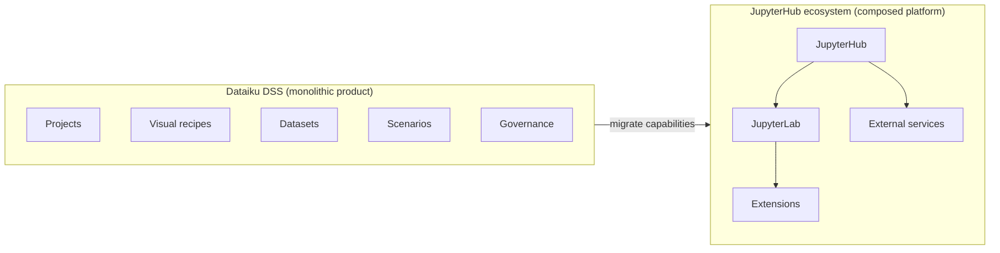
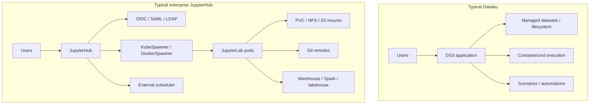
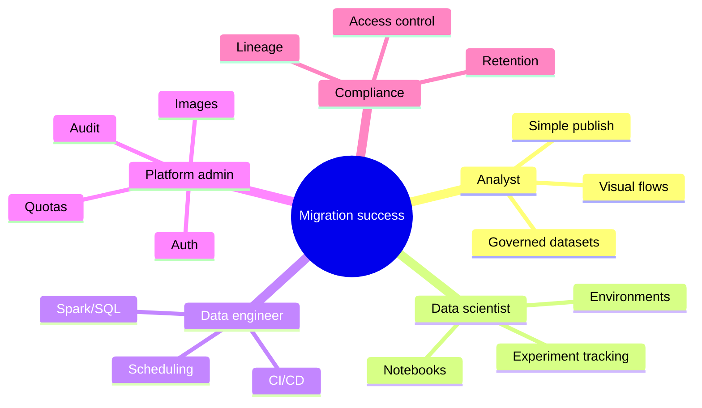
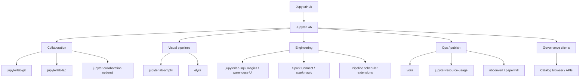
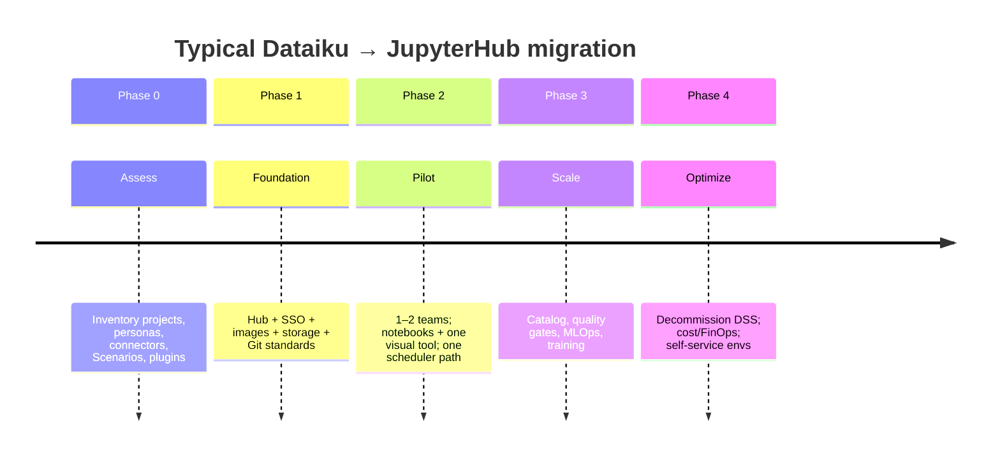

# Migrating from Dataiku to JupyterHub: Platform Comparison, Feature Mapping, and Extension Strategy

| Field | Value |
|---|---|
| Audience | Platform architects, IT/platform admins, analytics leads, Dataiku power users evaluating JupyterHub |
| Perspective | Industry best practices + end-user experience |
| Scope | Functional comparison, migration patterns, Jupyter ecosystem features/extensions that approximate Dataiku capabilities |
| Related Amphi context | Visual, JupyterLab-native ETL (optional complement on JupyterHub) |
| Document date | 2026-08-04 |
| Status | Guidance draft |

---

## Table of contents

1. [Executive summary](#1-executive-summary)
2. [How to read this document](#2-how-to-read-this-document)
3. [Product positioning](#3-product-positioning)
4. [Architecture comparison](#4-architecture-comparison)
5. [Persona-based needs](#5-persona-based-needs)
6. [Capability mapping matrix](#6-capability-mapping-matrix)
7. [Recommended JupyterHub / JupyterLab stack](#7-recommended-jupyterhub--jupyterlab-stack)
8. [Detailed capability playbooks](#8-detailed-capability-playbooks)
9. [Migration strategy (phased)](#9-migration-strategy-phased)
10. [What will feel different to users](#10-what-will-feel-different-to-users)
11. [Gaps, risks, and mitigations](#11-gaps-risks-and-mitigations)
12. [Reference architectures](#12-reference-architectures)
13. [Checklist for customer readiness](#13-checklist-for-customer-readiness)
14. [Appendix](#14-appendix)

---

## 1. Executive summary

**Dataiku** is an integrated **data science / analytics workbench**: projects, visual recipes, datasets, scenarios, governance, and collaboration are first-class product concepts.

**JupyterHub** is a **multi-user orchestration layer** for Jupyter: it authenticates users, spawns isolated notebook/Lab servers, and enforces resource policies. It is not a visual ETL product by itself. Value comes from composing:

```text
JupyterHub  +  JupyterLab  +  Identity/Storage/Compute  +  Extensions/Apps
```

To migrate existing Dataiku customers successfully, treat the move as **platform modernization**, not a 1:1 feature clone:

| Outcome customers care about | How JupyterHub ecosystems deliver it |
|---|---|
| Secure multi-user access | JupyterHub auth (OIDC/SAML/LDAP) + groups/roles |
| Familiar interactive IDE | JupyterLab (or JupyterLab Desktop / Notebook 7) |
| Shared projects & files | Shared volumes, Git, object storage, Hub shares |
| Visual / low-code pipelines | Amphi / Elyra / custom apps (choose one primary) |
| Scheduling & ops | Hub services + Airflow/Argo/Prefect/cron + CI |
| Governance & audit | IdP + lakehouse/catalog + policy engines + logging |
| Environments | Repo `environment.yml` / conda-store / repo2docker / custom images |

**Best practice:** Keep JupyterHub thin and reliable; push business capabilities into **Lab extensions**, **shared images**, and **platform services** (Git, scheduler, catalog, warehouse). That yields a stack that is more modular and often more cost-transparent than a monolithic DSS license—at the cost of more integration ownership.



---

## 2. How to read this document

| Symbol | Meaning |
|---|---|
| **Native** | Built into JupyterHub/Lab without much custom code |
| **Extension** | JupyterLab/Server extension or Hub service |
| **Platform** | Requires external system (Git, Airflow, Unity Catalog, etc.) |
| **Parity** | Close user experience to Dataiku |
| **Partial** | Achievable with process/tooling; UX differs |
| **Gap** | No clean equivalent; redesign required |

This guide favors **user journeys** (what analysts/engineers do daily) over vendor feature checklists.

---

## 3. Product positioning

### 3.1 One-line definitions

| Product | Positioning |
|---|---|
| **Dataiku** | End-to-end enterprise AI/analytics platform (visual + code + ops + governance in one product) |
| **JupyterHub** | Multi-tenant gateway that spawns per-user Jupyter servers with auth and resource control |
| **JupyterLab** | Primary interactive UI users live in after Hub login |

### 3.2 What JupyterHub is *not*

JupyterHub alone does **not** provide:

- Visual Flow / Recipe canvas (unless you add Amphi, Elyra, etc.)
- Managed “Dataset” objects with automatic schema lineage UI
- Built-in Scenario engine equivalent to Dataiku’s
- Out-of-the-box MLOps model registry / Feature Store
- DSS-style project permissions baked into one ACL model

Those must be **composed**. Migration success depends on selecting a clear composition strategy early.

### 3.3 Strategic trade-offs

| Dimension | Dataiku | JupyterHub ecosystem |
|---|---|---|
| Time-to-value for mixed persona teams | High (batteries included) | Medium (assemble stack) |
| Flexibility / open tooling | Constrained to DSS patterns | High (any Python/R/SQL stack) |
| Operational ownership | Vendor + admin of DSS | Platform team owns Hub + images + integrations |
| Cost model | Platform license + infra | Infra + engineering + optional commercial add-ons |
| Lock-in | High on DSS concepts | Lower; portable notebooks/Git/containers |
| Governance depth | Strong productized features | Strong if you integrate catalog/IdP/observability |

---

## 4. Architecture comparison



| Layer | Dataiku | JupyterHub reference pattern |
|---|---|---|
| Access | DSS login / SSO | Hub authenticators (OAuthenticator, LDAP, SAML) |
| Isolation | Projects + user/spaces | Per-user servers + namespaces/quotas |
| Compute | DSS execution engines | Kubernetes profiles / instance types |
| Storage | DSS dataset storage | Shared volumes + object storage + warehouse tables |
| Collaboration | DSS wiki, discussions, shared projects | Git + Hub groups + shared directories + chat outside |
| Automation | Scenarios | Airflow/Argo/Prefect/cron + Hub services |
| UI | DSS + optional Code Studio JupyterLab | JupyterLab as primary IDE |

**Industry practice:** On Kubernetes, prefer **Zero to JupyterHub (Z2JH)** with KubeSpawner, profile lists for “T-shirt sizes”, and image builds via repo2docker / CI.

---

## 5. Persona-based needs



| Persona | Dataiku expectation | JupyterHub success pattern |
|---|---|---|
| Business analyst | Visual recipes, few code skills | Amphi/Elyra + curated images + SQL warehouse access |
| Data scientist | Notebooks + experiments | Lab + Git + MLflow/W&B + environment profiles |
| Data engineer | Pipelines, schedules, Spark | Lab + Spark Connect/Airflow + dbt/SQL mesh as needed |
| Citizen developer | Guided UI, templates | Template repos + gallery + limited visual tools |
| Admin / IT | SSO, quotas, monitoring | Hub + K8s + IdP + Prometheus/Grafana |
| Risk / compliance | Audit, lineage, approvals | Catalog + policy + PR reviews + logging |

**User-centric principle:** Do not force every Dataiku visual user into raw notebooks on day one. Provide a **guided path** (templates + visual extension + office hours) or migration will stall on change management, not technology.

---

## 6. Capability mapping matrix

Legend: **Parity** / **Partial** / **Gap**

| Dataiku capability | JupyterHub / Lab approach | Fit | Primary mechanism |
|---|---|---|---|
| Multi-user login / SSO | JupyterHub authenticators | Parity | Native Hub |
| Projects | Git repos + shared volumes + naming conventions | Partial | Platform + process |
| Permissions / groups | Hub groups + K8s RBAC + storage ACLs + warehouse grants | Partial | Platform |
| Jupyter / Code Studio | JupyterLab as default UI | Parity | Native |
| Visual Flow / Recipes | Amphi, Elyra, custom | Partial→Parity* | Extension |
| Datasets (managed) | Tables in warehouse/lake + optional catalog | Partial | Platform |
| Connectors (DB/cloud) | Python libs + SQL/Spark + Lab connectors | Partial | Libs / extensions |
| Recipes (code) | Notebooks / scripts / papermill | Parity | Native + tools |
| Scenarios / scheduling | Airflow, Argo, Prefect, nbconvert CI | Partial | Platform |
| Plugins / custom UIs | Lab extensions, Voilà, Panel, Streamlit | Partial | Extension / app |
| Webapps | Voilà / Panel / Streamlit / FastAPI sidecars | Partial | App hosting |
| API designer | FastAPI/Flask in repo + API gateway | Partial | Platform |
| ML experiment tracking | MLflow, W&B, Aim | Partial | Platform |
| Model registry / deploy | MLflow Registry, KServe, BentoML, SageMaker | Partial | Platform |
| Feature Store | Feast / Tecton / vendor FS | Gap→Partial | Platform |
| Data lineage UI | OpenLineage + Marquez/DataHub/Amundsen/Unity | Partial | Platform |
| Data quality | Great Expectations / Soda / dbt tests | Partial | Platform |
| Collaboration comments | Git PRs, tickets, wiki | Partial | Process |
| Bundles / automation packs | Git tags + CI deploy | Partial | Process |
| Governed AI / LLM features | Separate GenAI gateway + policies | Gap→Partial | Platform |
| Resource monitoring | jupyter-resource-usage + K8s metrics | Partial | Extension + platform |

\*Parity for visual ETL is realistic if you standardize on **one** visual tool (e.g. Amphi) and train users; “all DSS recipe types” will remain Partial.

---

## 7. Recommended JupyterHub / JupyterLab stack

### 7.1 Core platform (baseline)

| Layer | Recommendation | Notes |
|---|---|---|
| Hub distribution | Zero to JupyterHub on Kubernetes | De-facto enterprise pattern |
| Spawner | KubeSpawner | Profiles for CPU/GPU/memory |
| Auth | OAuthenticator (OIDC) or SAML/LDAP | Match corporate IdP |
| UI | JupyterLab 4.x | Align versions across images |
| Storage | Home PVC + shared project volume + S3/GCS mounts | Separate personal vs team data |
| Images | Curated images per persona | Reproducibility > “pip in notebook forever” |

### 7.2 Extensions and tools by Dataiku-like need



#### A. Collaboration and IDE quality

| Extension / tool | User value | Dataiku analogue |
|---|---|---|
| **jupyterlab-git** | Commit/push from Lab | Project versioning (partial) |
| **jupyterlab-lsp** | Autocomplete, diagnostics | Code Studio DX |
| **jupyterlab-code-formatter** / Black-Ruff | Consistent style | Team standards |
| **jupyter-collaboration** (RTC) | Pairing on same notebook | Live co-edit (careful with security) |
| **jupyterlab-search-replace** | Repo-wide search | DSS search (partial) |
| Templates / nbgallery / cookiecutters | Starter projects | Project templates |

#### B. Visual / low-code pipelines

| Option | Strengths | Watch-outs |
|---|---|---|
| **Amphi (`jupyterlab-amphi`)** | Visual ETL in Lab; Python generation; fits Hub images | Not a full DSS Flow clone; standardize training |
| **Elyra** | Pipeline editor, runtime integration patterns | Can conflict with other pipeline editors if both register similar factories—test coexistence |
| Custom Voilà/Panel apps | Domain-specific guided UX | Higher build cost |

**Best practice for Dataiku migrants:** Pick **one** visual canvas as the default “Flow replacement,” document when to use notebooks vs visual, and provide recipe→pipeline translation workshops.

#### C. Data access (datasets / connectors)

| Approach | When to use |
|---|---|
| Warehouse SQL (Snowflake, BigQuery, Redshift, Trino) | Primary governed data plane |
| Object storage + Iceberg/Delta | Lakehouse pattern |
| Spark Connect from Lab | Large-scale SQL/DataFrame compute |
| `sqlalchemy` / vendor connectors in image | Familiar Python access |
| Optional Lab SQL UIs | Analysts who prefer GUI browse |

Treat the **warehouse/lakehouse + catalog** as the successor to DSS Datasets—not files inside Hub alone.

#### D. Scheduling and automation (Scenarios)

| Tool | Fit |
|---|---|
| **Apache Airflow** | Enterprise DAG scheduling, common replacement pattern |
| **Argo Workflows** | K8s-native |
| **Prefect / Dagster** | Pythonic orchestration |
| **papermill + cron/CI** | Lightweight notebook jobs |
| Hub **services** / custom buttons | In-Hub triggers (complement, not full Scenario engine) |

#### E. Publishing and apps (Dashboards / Webapps)

| Tool | Fit |
|---|---|
| **Voilà** | Turn notebooks into apps |
| **Panel / Plotly Dash / Streamlit** | Richer apps (host beside Hub or in K8s) |
| **nbconvert** | Static reports |
| Quarto | Docs + reports |

#### F. Environments (Code envs)

| Tool | Fit |
|---|---|
| Multi-profile Hub images | Persona-based stacks |
| **conda-store** / **repo2docker** | User/team env builds |
| Locked `environment.yml` / `requirements.txt` in Git | Reproducible projects |
| Kernel gateway / multiple kernels | R/Julia alongside Python |

#### G. Governance, lineage, quality

| Tool | Fit |
|---|---|
| **DataHub / Amundsen / OpenMetadata / Unity Catalog** | Catalog + lineage UX |
| **OpenLineage** | Job-level lineage emission |
| **Great Expectations / Soda** | Data quality gates |
| IdP groups + warehouse RBAC | Access control |
| Central audit logging (Hub + K8s + warehouse) | Compliance evidence |

#### H. MLOps

| Tool | Fit |
|---|---|
| **MLflow** | Tracking + registry (common) |
| W&B / Comet | Experiment UX |
| KServe / BentoML / Vertex/SageMaker | Serving |
| Feast | Feature store |

---

## 8. Detailed capability playbooks

### 8.1 “I open Dataiku and see my project Flow”

**User goal:** Understand pipeline at a glance; edit steps visually.

| On JupyterHub | Practice |
|---|---|
| Amphi / Elyra pipeline files in Git | One pipeline = one versioned artifact |
| README + Mermaid in repo | Documentation for non-visual viewers |
| Naming conventions | `project-slug/` mirrors DSS project keys |

**Change management tip:** Keep a “Flow → Pipeline” cheat sheet mapping DSS recipe types to Amphi components or notebook templates.

### 8.2 “I use managed Datasets with schemas”

**User goal:** Trusted tables, not ad-hoc CSVs.

| On JupyterHub | Practice |
|---|---|
| Curated schemas in warehouse | `analytics.`, `marts.`, `sandbox.` |
| Catalog as source of truth | Search/discover like Dataset list |
| Lab only holds working copies | Avoid Hub disk as system of record |

### 8.3 “I schedule a Scenario overnight”

**User goal:** Reliable unattended runs with alerts.

| On JupyterHub | Practice |
|---|---|
| Airflow DAG calling papermill/nbconvert or Python modules | Explicit dependencies & retries |
| Alerts via email/Slack from orchestrator | Parity with Scenario reporters |
| Separate “run identity” service account | Don’t schedule as interactive user cookies |

### 8.4 “I collaborate with comments and shared projects”

**User goal:** Review and co-own work.

| On JupyterHub | Practice |
|---|---|
| Git PRs as review surface | Closest to durable collaboration |
| Shared team volume + branch protections | Prevent silent overwrites |
| Optional RTC for short pairing sessions | Not a substitute for Git |

### 8.5 “I build a Webapp for stakeholders”

**User goal:** Non-Lab users consume results.

| On JupyterHub | Practice |
|---|---|
| Voilà from validated notebooks | Fast path |
| Streamlit/Panel behind SSO gateway | Stakeholder UX |
| Publish metrics to BI tools | Often better than cloning DSS webapps |

### 8.6 “I need governance for audits”

**User goal:** Who accessed what; approved data; reproducible runs.

| On JupyterHub | Practice |
|---|---|
| SSO + group-based Hub profiles | Entry control |
| Warehouse grants + row policies | Data control |
| OpenLineage from jobs | Lineage |
| Immutable Git tags for production pipelines | Change control |

---

## 9. Migration strategy (phased)



### Phase 0 — Discover (2–6 weeks)

- Inventory DSS projects by criticality and recipe mix (visual vs code).
- Map connectors → warehouse/Spark/object storage.
- List Scenarios → candidate DAGs.
- Identify plugins/custom UIs that must be rebuilt.
- Survey users: who *needs* visual Flow vs who already lives in notebooks.

### Phase 1 — Platform foundation

- Deploy JupyterHub (Z2JH), SSO, quotas, backup of home volumes.
- Publish **golden images** (analyst / scientist / engineer).
- Define Git layout and branching model.
- Stand up shared project storage pattern.

### Phase 2 — Pilot migration

- Migrate 1–2 friendly projects end-to-end.
- Teach dual paths: notebook-first and visual-first (Amphi/Elyra).
- Implement one Scenario replacement in Airflow (or chosen orchestrator).
- Measure: time-to-first-success, support tickets, user NPS.

### Phase 3 — Scale and governance

- Integrate catalog + quality tests for “Dataset” parity.
- Roll out scheduling patterns as templates.
- Add MLOps if ML projects are in scope.
- Formal training + office hours for Dataiku habits → Hub habits.

### Phase 4 — Decommission

- Freeze DSS writes; read-only period.
- Archive DSS projects; cut over DNS/SSO bookmarks.
- FinOps review (Hub idle servers, image sprawl).

**Best practice:** Never “big-bang” cutover for all visual Flow users without a pilot. Parallel-run critical Scenarios until orchestrator metrics match.

---

## 10. What will feel different to users

| Dataiku habit | JupyterHub experience | How to soften the landing |
|---|---|---|
| Single product UI | Hub → Lab → other tools | Single bookmark portal / Hub homepage with links |
| Project = DSS container | Project = Git repo + volume | Project cookiecutter |
| Dataset clicks | Catalog + SQL/Spark | Teach discovery in catalog first |
| Visual recipes everywhere | Mix of visual + code | Default visual tool + templates |
| Scenario UI | Orchestrator UI | “Runbook” buttons/docs in Lab |
| Built-in discussions | PRs / tickets | Agree team communication norms |
| Plugin store feel | Image change requests | Self-service env request SLA |
| Automatic lineage in-product | Catalog lineage | Make lineage visible in training |

**User-centric KPIs for migration health**

- Time for a new user to run a template pipeline successfully
- % of former DSS visual users active weekly in Lab
- Number of P0 “I can’t find my data” tickets
- Scenario/DAG success rate vs DSS baseline

---

## 11. Gaps, risks, and mitigations

| Risk | Why it happens | Mitigation |
|---|---|---|
| Expecting Hub = Dataiku | Category mismatch | Education + capability matrix |
| Visual user drop-off | Notebook shock | Amphi/Elyra + training + champions |
| Shadow IT pip installs | No env governance | Golden images + conda-store policy |
| Data sprawl on PVCs | Hub disk as lake | Warehouse-first policy |
| Dual pipeline editors conflict | Elyra + other editors | Standardize; test labextension coexistence |
| Weak scheduling parity | Underestimating Scenarios | Invest early in orchestrator templates |
| Compliance rejection | Missing lineage/ACL story | Catalog + IdP + audit before scale |
| Cost surprise | Idle Hub servers / GPUs | Cull idle servers, profiles, FinOps dashboards |
| Hidden DSS plugins | Custom Java/Python plugins | Inventory in Phase 0 |

---

## 12. Reference architectures

### 12.1 Analyst-centric (closest to DSS visual culture)

```text
IdP → JupyterHub → JupyterLab
                 ├─ Amphi (visual ETL)
                 ├─ jupyterlab-git
                 ├─ SQL / warehouse
                 └─ Voilà for light apps
Orchestrator (Airflow) for production refreshes
Catalog for governed datasets
```

### 12.2 Code-centric (data science / engineering heavy)

```text
IdP → JupyterHub → JupyterLab
                 ├─ LSP + Git
                 ├─ Spark Connect / dbt
                 ├─ MLflow
                 └─ papermill
Argo/Airflow + CI for promotion
```

### 12.3 Hybrid (recommended for most Dataiku estates)

```text
Same Hub; multiple profiles:
  - analyst image (+ Amphi)
  - scientist image (+ MLflow)
  - engineer image (+ Spark/dbt clients)
Shared: Git, catalog, orchestrator, warehouse
```

---

## 13. Checklist for customer readiness

### Platform

- [ ] SSO integrated with corporate IdP
- [ ] Per-user isolation + resource quotas
- [ ] Backup/restore for home and shared volumes
- [ ] Golden images versioned and documented
- [ ] Idle culling / cost controls enabled

### Data

- [ ] System-of-record decided (warehouse/lake ≠ Hub disk)
- [ ] Connector inventory mapped
- [ ] Catalog selected or roadmap agreed
- [ ] Sandbox vs production schemas defined

### Workload

- [ ] Visual tool standard chosen (Amphi/Elyra/other)
- [ ] Scenario → DAG pattern documented
- [ ] CI for lint/test of shared libraries
- [ ] App publishing path (Voilà/Streamlit/BI)

### People

- [ ] Champions per persona
- [ ] Training curriculum (Lab basics + visual tool + Git)
- [ ] Support model (L1 Lab, L2 platform, L3 data)
- [ ] Success metrics agreed with business sponsors

---

## 14. Appendix

### 14.1 Quick glossary

| Term | Meaning |
|---|---|
| JupyterHub | Multi-user proxy/spawner for Jupyter servers |
| JupyterLab | Web IDE users interact with |
| Spawner | Mechanism that starts each user’s server (Docker/K8s) |
| Profile | Named server option (image + resources) |
| Z2JH | Zero to JupyterHub Helm chart distribution |
| Papermill | Parameterized notebook execution |
| Voilà | Notebook-to-webapp renderer |

### 14.2 Suggested Lab extension starter set (enterprise Hub image)

| Package | Purpose |
|---|---|
| `jupyterlab` | IDE |
| `jupyterlab-git` | Git UI |
| `jupyterlab-lsp` + language servers | DX |
| `jupyter-resource-usage` | Memory/CPU awareness |
| `jupyterlab-amphi` *(or Elyra—pick one visual primary)* | Visual pipelines |
| `voila` | Lightweight apps |
| Optional: `jupyterlab-sql` / vendor tools | SQL UX |

Pin versions; test extension compatibility on the target JupyterLab minor (e.g. 4.5.x).

### 14.3 Amphi note (relevant to this repository)

Amphi provides a **JupyterLab-native visual ETL** experience that can reduce friction for Dataiku Flow users moving to Hub. It complements—not replaces—warehouse governance, scheduling, and catalog. For Hub deployments:

- Bake `jupyterlab-amphi` into the analyst image.
- Store `.ampln` pipelines in Git next to notebooks.
- Execute production refreshes via orchestrator-invoked generated Python or scheduled Lab jobs—not only interactive clicks.
- Validate coexistence if Elyra is also installed (document editor factory conflicts if any).

### 14.4 Decision guide: stay vs migrate

| Prefer Dataiku when… | Prefer JupyterHub ecosystem when… |
|---|---|
| You need deep productized visual+governance ASAP with small platform team | You want open tooling, portable Git/notebooks, K8s-native ops |
| Heavy reliance on DSS-specific plugins | Strong engineering capacity to integrate catalog/orchestrator |
| License model already fits | Cost/flexibility of composed stack is strategic |

Many enterprises run **hybrid periods**: DSS for legacy Flows, Hub for code-heavy and new work—then narrow DSS footprint.

### 14.5 References (starting points)

- Zero to JupyterHub documentation  
- JupyterHub authenticators / KubeSpawner docs  
- JupyterLab extension development & extension manager  
- Airflow / Argo / Prefect docs for Scenario replacement patterns  
- OpenLineage / DataHub (or your catalog vendor) for Dataset/lineage parity  
- Project Amphi / Elyra documentation for visual pipelines  

---

## Closing recommendation

From a **user** perspective, successful Dataiku → JupyterHub migration means:

1. **Hub feels like a company portal**, not a naked notebook URL.  
2. **Data discovery feels governed**, not “files on a pod.”  
3. **Visual users are not abandoned**—a chosen Lab visual tool + templates bridge the Flow habit.  
4. **Automation lives in a real orchestrator**, with Hub as the development surface.  
5. **Platform team owns the composition**, with clear SLAs for images, access, and support.

JupyterHub wins on openness and composability; Dataiku wins on integrated product depth. Migration quality is determined less by Hub itself and more by the **extensions and platform services** you standardize around it.
