# Spark SQL Input — Detailed Design

| Field | Value |
|---|---|
| Status | Implemented (v1 + Spark DF family through S68) |
| Feature | Spark SQL Input via Spark Connect (+ native Spark DF operators) |
| Component id | `sparkSqlInput` (plus `spark_df_*` family) |
| Class name | `SparkSqlInput` |
| Package | `jupyterlab-amphi` / `@amphi/pipeline-components-core` |
| Tracking | [spark-sql-input-stories.md](./spark-sql-input-stories.md) |
| Document date | 2026-08-04 |
| Last reviewed | 2026-08-06 |

---

## Table of contents

1. [Executive summary](#1-executive-summary)
2. [Background and problem statement](#2-background-and-problem-statement)
3. [Goals, non-goals, and success criteria](#3-goals-non-goals-and-success-criteria)
4. [Current Amphi architecture](#4-current-amphi-architecture)
5. [Design decisions](#5-design-decisions)
6. [Solution architecture](#6-solution-architecture)
7. [Component specification](#7-component-specification)
8. [Form and UX specification](#8-form-and-ux-specification)
9. [Connection and credentials](#9-connection-and-credentials)
10. [Code generation specification](#10-code-generation-specification)
11. [Dependencies and versioning](#11-dependencies-and-versioning)
12. [Security](#12-security)
13. [Registration, packaging, and build](#13-registration-packaging-and-build)
14. [Testing strategy](#14-testing-strategy)
15. [Risks and mitigations](#15-risks-and-mitigations)
16. [Roadmap](#16-roadmap)
17. [Implementation checklist](#17-implementation-checklist)
18. [Appendix](#18-appendix)
19. [Document revision notes](#19-document-revision-notes)

---

## 1. Executive summary

Amphi has no first-class way to run **Spark SQL** against a remote cluster. This document specifies **Spark SQL Input**: a new pipeline input that:

1. Connects via **Apache Spark Connect** (`sc://…`).
2. Runs user SQL (or a table-name shortcut).
3. Emits **PySpark** through Amphi’s existing code-generation path.
4. Collects a **bounded** result into a **pandas DataFrame** so current transforms/outputs work unchanged.

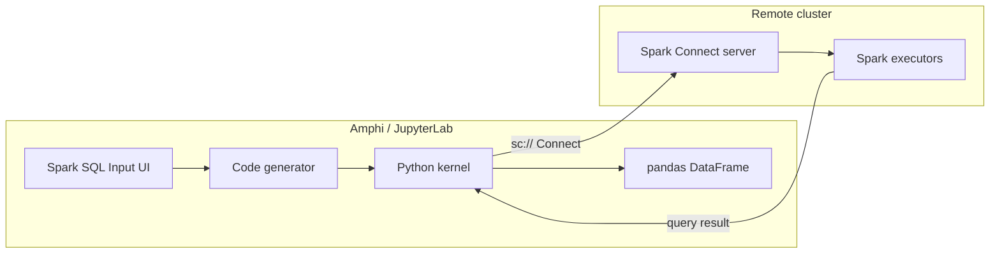

**v1 priorities:** pandas compatibility, safe collection defaults, env-based credentials.  
**Shipped beyond v1:** shared session, native `spark_df_*` operators (filter/join/window/…), bridges, catalog Retrieve, Databricks URL preset (see stories **S1–S68**).  
**Still deferred:** Kerberos / Databricks OAuth wizards; live Connect QA matrix (manual).

Delivery work is tracked in [spark-sql-input-stories.md](./spark-sql-input-stories.md) (Stories S1–S68).

---

## 2. Background and problem statement

### 2.1 What exists today

Under `@amphi/pipeline-components-core`, inputs share one pattern:

| Step | Mechanism |
|---|---|
| Define | Extend `BaseCoreComponent` + `form.fields` |
| Generate | `provideImports` / `provideDependencies` / `generateComponentCode` |
| Register | `componentService.addComponent(...)` in `src/index.ts` |

Database inputs (MySQL, Postgres, SQL Server, Snowflake, ODBC, facade `DatabaseInput`) use SQLAlchemy/ODBC and `pd.read_sql`. There is **no** Spark / Spark Connect / JDBC palette component.

Incidental mentions elsewhere (metadata-panel `pyspark` type sniffing, decorative icons) are **not** connectors.

### 2.2 Why Spark Connect

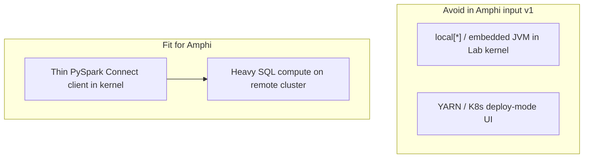

Spark Connect keeps a thin client in the Jupyter kernel and leaves compute on the cluster. That matches Amphi’s “orchestrate in Lab, execute elsewhere” model better than embedding cluster deploy modes in an input component.

### 2.3 Why not fold into Database Input

| Concern | Database Input | Spark SQL Input |
|---|---|---|
| Protocol | SQLAlchemy / ODBC | Spark Connect (gRPC) |
| Runtime | DB driver | PySpark Connect client |
| Semantics | Query a database | Run distributed Spark SQL |
| Result path | `pd.read_sql` | `spark.sql` → `toPandas()` |

Mixing both in one provider dropdown would confuse dependencies, troubleshooting, and mental models. **v1 ships a standalone component** under `inputs.Spark`.

---

## 3. Goals, non-goals, and success criteria

### 3.1 Goals (v1)

| ID | Goal |
|---|---|
| G1 | Palette entry **Spark SQL Input** under Inputs → Spark |
| G2 | Connect with remote URL and optional token |
| G3 | Custom SQL **and** table-name shortcut |
| G4 | Readable PySpark: `remote(...).getOrCreate()` + `spark.sql` |
| G5 | Output pandas via `.toPandas().convert_dtypes()` |
| G6 | **Max rows** guard + memory risk messaging |
| G7 | Prefer Env / Connection over secrets in `.ampln` |

### 3.2 Non-goals (v1)

| ID | Non-goal |
|---|---|
| N1 | Spark DataFrame transform/output family |
| N2 | Spark as a `DatabaseInput` provider |
| N3 | UI for `local[*]`, YARN, or K8s masters |
| N4 | Full catalog / schema / table browser |
| N5 | Kerberos or interactive mTLS cert UI |
| N6 | Databricks-only auth wizards |
| N7 | Hard global `pyspark` dependency for all Amphi installs |

### 3.3 Success criteria

| Criterion | Measure |
|---|---|
| Discoverability | Component in palette; no activation errors |
| Connectivity | SQL succeeds against a live Connect endpoint |
| Compatibility | Result works with existing pandas nodes |
| Safety | Default max rows bounds accidental full collects |
| Operability | URL ± token via form and/or env |
| Quality | Generated code reviewable; uses `getOrCreate()` |

---

## 4. Current Amphi architecture

### 4.1 Component lifecycle

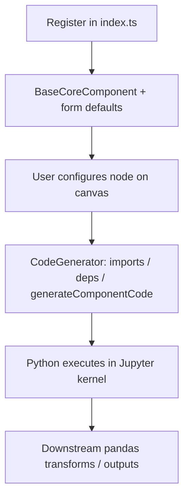

### 4.2 Patterns to reuse

| Pattern | Reference | Reuse |
|---|---|---|
| SQL editor | `PostgresInput` / `MySQLInput` | `codeTextarea` + `mode: "sql"` + `{code}` JSON |
| Table vs query | DB inputs `tsCFradioQueryMethod` | Same radio UX |
| Credentials | `Connection`, `EnvFile`, `EnvVariables` | `connection: "SparkConnect"` |
| Standalone vs facade | Prefer dedicated class (not a `DatabaseInput` provider) | Like a focused input, not a multi-DB facade |

### 4.3 Output type constraint

Nearly all Amphi transforms expect pandas. Using `type: "pandas_df_input"` plus `toPandas()` is the lowest-friction v1 integration path.

---

## 5. Design decisions

Summary of industry-aligned choices that drive the v1 spec. Details that only restate this table are omitted elsewhere.

| # | Topic | v1 decision | Defer |
|---|---|---|---|
| D1 | Output | Always pandas (`.toPandas().convert_dtypes()`) | Optional Spark DF (v2) |
| D2 | Query UX | SQL primary; table → `SELECT * FROM …` | Live metadata browser |
| D3 | Auth | URL + optional token; env-first; v1.1 adds userpass → URL `user_id`/`token` | Kerberos, vendor OAuth wizards |
| D4 | Session | Per-snippet `getOrCreate()` | Shared Session settings node |
| D5 | Engine | Spark Connect only | `local[*]` / YARN UI |
| D6 | Scale | Max rows default **10000**; `.limit(N)`; effective **min(Max rows, SQL LIMIT)** | Catalog browser |
| D7 | Entry | Standalone `inputs.Spark` | — |
| D8 | Deps | Component-declared **`pyspark[connect]`**; baseline **3.5+** | Global requirements pin |

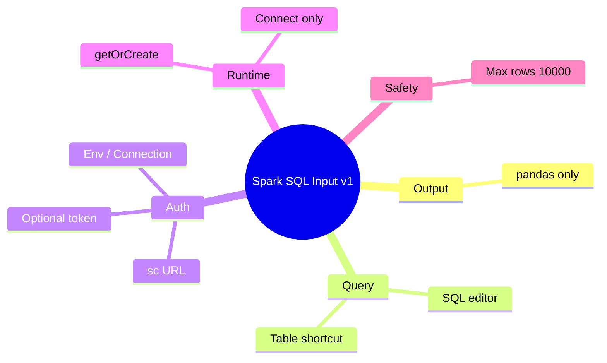

**Rationale highlights**

- **pandas:** Without Spark downstream nodes, keeping a Spark DF has little user value.
- **SQL-first:** Matches warehouse / Databricks UX; Connect catalog APIs vary by deployment.
- **`getOrCreate()`:** Same kernel + same remote reuses a session without a settings node.
- **Connect-only:** Avoids embedding a heavy JVM master inside Lab.
- **Max rows:** `toPandas()` is a client-memory collect; bound it by default.

**Open implementation detail (must confirm in S4.4):** exact PySpark Connect config key / API for token auth on the chosen client version. Isolate in one codegen block.

---

## 6. Solution architecture

### 6.1 End-to-end data path

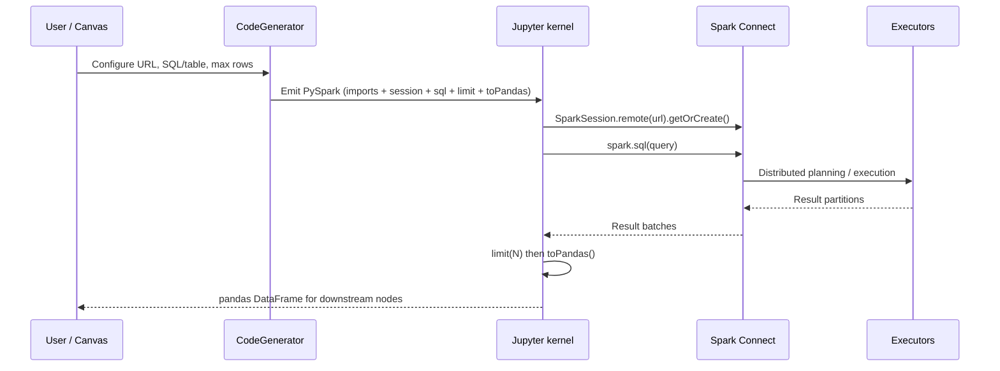

### 6.2 Logical layers

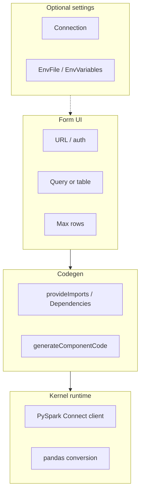

| Layer | Responsibility |
|---|---|
| Form UI | Capture Connect URL, auth, query method, SQL/table, max rows |
| Codegen | Emit PySpark + pandas conversion |
| Kernel | Execute against Connect; surface native errors |
| Settings | Optional URL/token via Connection / Env |

### 6.3 No new Jupyter server extension (v1)

Connectivity is **in-process** from the kernel (like DB drivers). No custom Jupyter Server handler is required for v1.

---

## 7. Component specification

### 7.1 Identity

| Property | Value |
|---|---|
| Display name | Spark SQL Input |
| Class | `SparkSqlInput` |
| Id | `sparkSqlInput` |
| Type | `pandas_df_input` |
| Category | `inputs.Spark` |
| File drop | `[]` |
| Source | `packages/pipeline-components-core/src/components/inputs/spark/SparkSqlInput.tsx` |
| Icon | New SVG (e.g. `spark-sql-input.svg`) in `style/icons/` + `icons.ts` |

**User-facing description:**  
“Run Spark SQL against a Spark Connect endpoint and load the result as a pandas DataFrame. Requires a reachable Spark Connect server and a matching PySpark client.”

### 7.2 Default configuration

```ts
const defaultConfig = {
  tsCFinputSparkConnectUrl: "sc://localhost:15002",
  tsCFinputAppName: "amphi-spark-sql-input",
  tsCFradioAuthMethod: "none",      // "none" | "token" | "userpass"
  tsCFinputToken: "",
  tsCFinputUserName: "",
  tsCFinputPassword: "",
  tsCFradioQueryMethod: "query",    // "query" | "table"
  tsCFinputTableName: "",
  tsCFcodeTextareaSqlQuery: "",
  tsCFinputMaxRows: "10000"
};
```

Keep `tsCF*` naming consistent with sibling inputs.

### 7.3 Public methods

| Method | Behavior |
|---|---|
| `provideDependencies({ config })` | `["pyspark[connect]"]` |
| `provideImports({ config })` | `SparkSession`, `os` |
| `generateComponentCode({ config, outputName })` | See [§10](#10-code-generation-specification) |

---

## 8. Form and UX specification

### 8.1 Field visibility

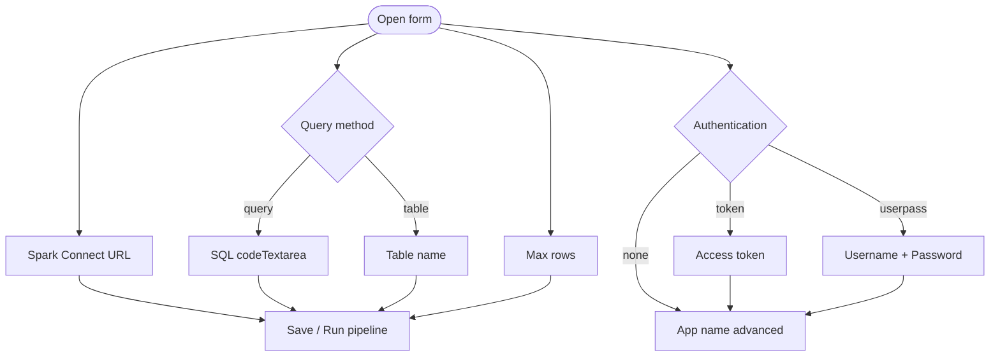

### 8.2 Field catalog

| Field id | Type | Label | Notes |
|---|---|---|---|
| `tsCFinputSparkConnectUrl` | `input` | Spark Connect URL | Placeholder `sc://host:15002`; `connection: "SparkConnect"` |
| `tsCFradioAuthMethod` | `radio` | Authentication | `none` / `token` / `userpass` |
| `tsCFinputToken` | `input` (password) | Access token | If auth=token; `connection: "SparkConnect"` |
| `tsCFinputUserName` | `input` | Username | If auth=userpass; `connection: "SparkConnect"` |
| `tsCFinputPassword` | `input` (password) | Password | If auth=userpass; `connection: "SparkConnect"` |
| `tsCFinputAppName` | `input` | Application name | Advanced |
| `tsCFradioQueryMethod` | `radio` | Query method | `query` / `table` |
| `tsCFcodeTextareaSqlQuery` | `codeTextarea` | SQL query | `mode: "sql"`; ~150px; if query |
| `tsCFinputTableName` | `input` | Table name | If table; allow `catalog.schema.table` |
| `tsCFinputMaxRows` | `input` | Max rows | Default `10000` |

### 8.3 Copy

**SQL placeholder:**

```sql
SELECT *
FROM samples.nyctaxi.trips
LIMIT 1000
```

**Max rows tooltip:**  
“Results are collected into the Jupyter client with toPandas(). Large results can exhaust memory. Prefer filtering and projection in SQL. Max rows applies DataFrame.limit().”

**URL tooltip:**  
“Spark Connect remote, e.g. sc://spark-connect-server:15002. Prefer SPARK_CONNECT_URL via Env/Connection in shared environments.”

### 8.4 Validation (v1)

| Rule | When |
|---|---|
| URL non-empty | Always |
| Token non-empty | Soft-require when auth=token |
| SQL non-empty | Query mode |
| Table name non-empty | Table mode |
| Identifier charset | `[A-Za-z0-9_.\`]+` style; reject `;` |
| Max rows | Integer **≥ 1** in v1 (default 10000). No “unlimited” escape hatch in the UI for v1 |

Live `SHOW TABLES` discovery is available via table-mode **Retrieve** (S10.4 / S14.4).

---

## 9. Connection and credentials

### 9.1 Integration model

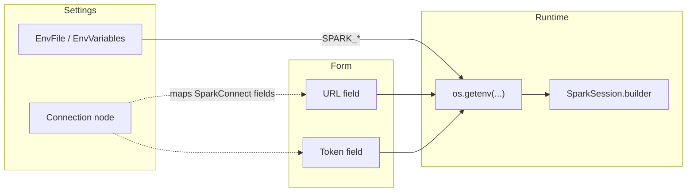

- Tag URL/token (optionally app name) with `connection: "SparkConnect"`.
- Optional P1: add a SparkConnect preset in `Connection.tsx` if templates are maintained there.

### 9.2 Environment variables

| Variable | Purpose |
|---|---|
| `SPARK_CONNECT_URL` | Connect remote URL |
| `SPARK_TOKEN` | Optional access token (also password fallback for userpass) |
| `SPARK_USER` | Optional username (userpass → URL `user_id=`) |
| `SPARK_PASSWORD` | Optional password (userpass → URL `token=`) |
| `SPARK_APP_NAME` | Optional application name |

### 9.3 Secret policy

1. Prefer `os.getenv` at runtime when Env/Connection is used.
2. Never print tokens, passwords, or secret-bearing URLs.
3. Discourage committing tokens/passwords inside `.ampln` (form secrets are persisted in pipeline JSON if filled).
4. Username/password is mapped to Connect URL params `user_id` / `token` (common gateway pattern). Vendor-specific auth (Kerberos, Databricks OAuth wizards) remains out of scope for v1.1.

---

## 10. Code generation specification

### 10.1 Generation flow

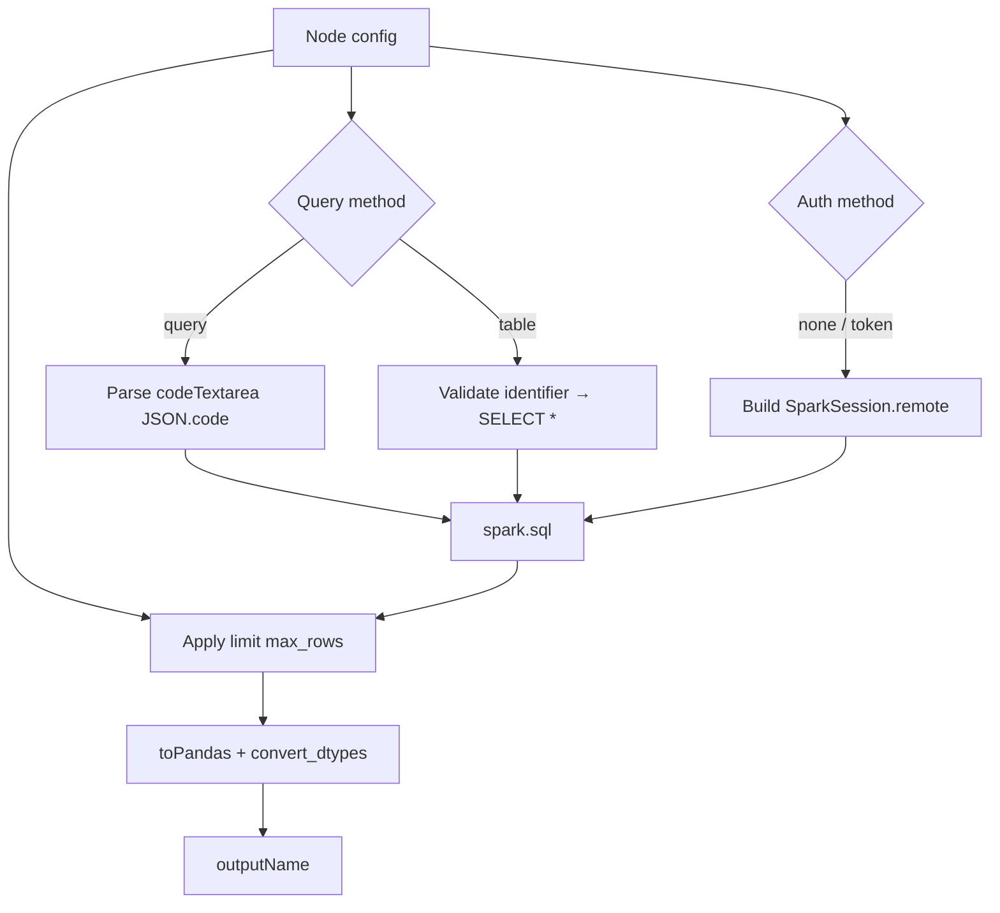

### 10.2 Target skeleton

```python
# Spark SQL Input
_spark_url = os.getenv("SPARK_CONNECT_URL", "{url_fallback}")
_app_name = os.getenv("SPARK_APP_NAME", "{app_name_fallback}")

_builder = SparkSession.builder.appName(_app_name).remote(_spark_url)

_token = os.getenv("SPARK_TOKEN", "{token_fallback_or_empty}")
if _token:
    # Confirm config key against target PySpark Connect version (Story S4.4).
    _builder = _builder.config("spark.connect.authenticate.token", _token)

spark = _builder.getOrCreate()

{outputName} = spark.sql("""
{sql}
""")

_max_rows = {max_rows_int}
if _max_rows > 0:
    {outputName} = {outputName}.limit(_max_rows)

{outputName} = {outputName}.toPandas().convert_dtypes()
```

Keep auth in **one** isolated block so API changes do not rewrite the SQL path.

### 10.3 Query mode

1. Read `tsCFcodeTextareaSqlQuery`.
2. If JSON with `code`, use `code`; else raw string.
3. Reject empty SQL.
4. Emit triple-quoted string to `spark.sql`.

### 10.4 Table mode

1. Validate `tsCFinputTableName`.
2. Emit `SELECT * FROM {qualified_name}` with conservative quoting.
3. Reject multi-statement input.

### 10.5 Max rows

| Value | Behavior |
|---|---|
| Integer N ≥ 1 | `{output}.limit(N)` before `toPandas()` |
| Missing / invalid | Fall back to **10000** |
| SQL already has trailing `LIMIT k` | Effective limit = **`min(N, k)`** |

### 10.5 Dependencies declaration

`provideDependencies` returns `["pyspark[connect]"]` so Amphi’s install helper runs a direct `pip install pyspark[connect]` (extras form).

### 10.6 Runtime errors

Generated code wraps the Connect/SQL/`toPandas` path in `try/except` and re-raises `RuntimeError` with setup hints. Underlying exceptions remain available via `__cause__`.

---

## 11. Dependencies and versioning

### 11.1 Python packages

| Package | Role | Declaration |
|---|---|---|
| `pyspark` | Connect client + SQL | `provideDependencies` |
| Connect extras / gRPC | Environment-specific | Document `pip install "pyspark[connect]"` (or current official notes) |

Do **not** add `pyspark` to global Amphi requirements unless product later requires it.

### 11.2 Version alignment

| Guidance | Detail |
|---|---|
| Baseline | PySpark / Spark **3.5+** |
| Compatibility | Client ≈ Connect server |
| Stretch | 3.4+ only if required; document caveats |

### 11.3 JupyterLab

No new Lab APIs. Build against the repo’s supported line (`jupyterlab>=4.4.0,<5` for current Amphi packages — 4.4.x / 4.5.x / 4.6.x).

---

## 12. Security

| Topic | Guidance |
|---|---|
| Secrets | Prefer Env/Connection |
| SQL injection | Table mode: validate identifiers; query mode: designer-trusted SQL |
| Multi-statement | Reject `;` batches where practical |
| Logging | Never log tokens |
| Network | Connect often behind internal gateways / TLS terminators |

---

## 13. Registration, packaging, and build

### 13.1 Code touchpoints

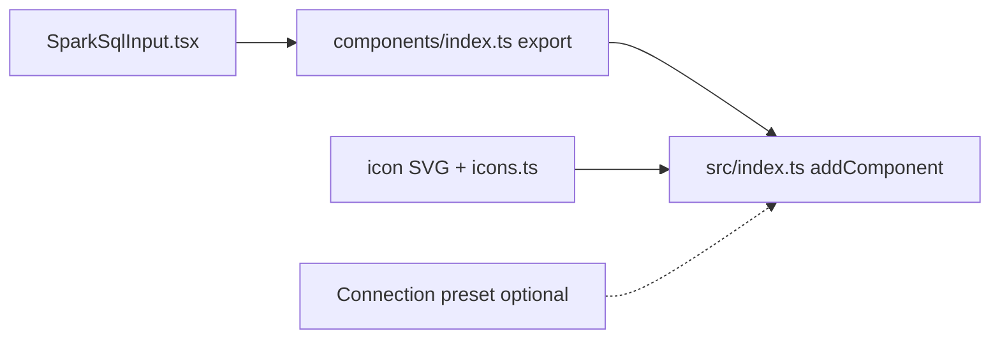

1. Create `inputs/spark/SparkSqlInput.tsx`.
2. Export from `components/index.ts`.
3. `addComponent(SparkSqlInput.getInstance())` with other Inputs.
4. Register icon.
5. Optionally extend Connection presets.

### 13.2 Developer build

```bash
cd jupyterlab-amphi
jlpm install
jlpm build:prod
python -m pip install --force-reinstall --no-deps --no-build-isolation .
```

Confirm palette entry and a smoke pipeline against Connect.

---

## 14. Testing strategy

### 14.1 Static / unit

- Default config shape.
- Codegen goldens: query, table, token/env, max rows.
- Identifier validation helper.

### 14.2 Integration matrix

| Case | Expected |
|---|---|
| Valid URL + simple SQL | Non-empty pandas DF |
| Token auth (if required) | Success |
| Bad URL | Clear connection error |
| Invalid SQL | Analysis / parse exception |
| Max rows = 5 | ≤ 5 rows |
| Table mode | SELECT works |
| Downstream Filter + CSV Output | Works |
| Env-provided URL | Works without form secret |

### 14.3 Regression

Database Input, Connection, and EnvFile behavior unchanged.

---

## 15. Risks and mitigations

| Risk | Impact | Mitigation |
|---|---|---|
| `toPandas()` OOM | Kernel death | Max rows, tooltips, SQL filters |
| Client/server skew | Cryptic Connect errors | Document version alignment |
| Auth API variance | Token path breaks | Isolate auth codegen; verify in S4.4 |
| Users expect Spark lineage | Confusion | UI copy: pandas in v1 |
| Secrets in `.ampln` | Leakage | Env/Connection guidance |
| Expectation of table browser | Support load | Explicit non-goal; Story S10 |

---

## 16. Roadmap

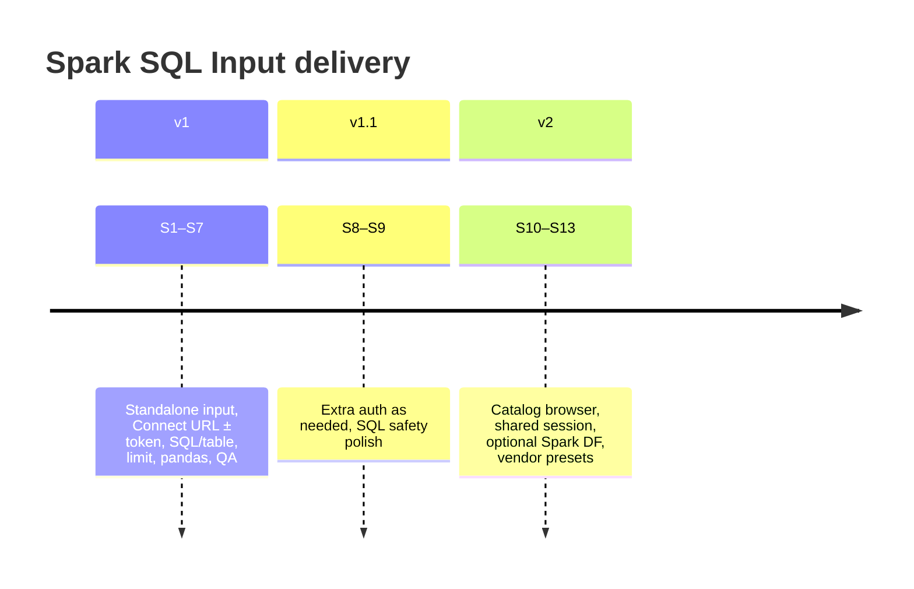

| Phase | Scope | Stories |
|---|---|---|
| **v1** | Standalone input, Connect, SQL/table, limit, pandas | S1–S7 |
| **v1.1** | Extra auth, SQL safety | S8–S9 |
| **v2** | Browser, shared session, Spark DF, vendors | S10–S13 |

**v1 story dependency (from tracker):**

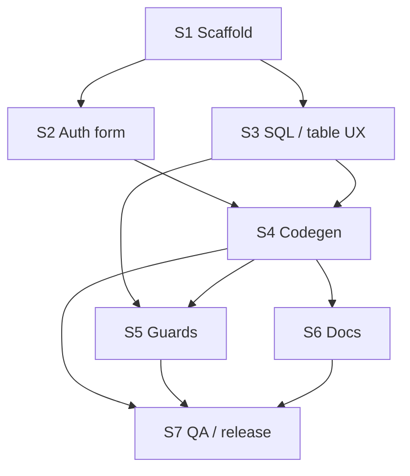

Full subtasks: [spark-sql-input-stories.md](./spark-sql-input-stories.md).

---

## 17. Implementation checklist

| Path | Action |
|---|---|
| `.../inputs/spark/SparkSqlInput.tsx` | Create |
| `.../components/index.ts` | Export |
| `.../src/index.ts` | Register |
| `.../src/icons.ts` + `style/icons/spark-sql-input.svg` | Icon |
| `.../settings/Connection.tsx` | Optional SparkConnect preset |
| `docs/spark-sql-input-design.md` | Design (this file) |
| `docs/spark-sql-input-stories.md` | Tracking |

---

## 18. Appendix

### 18.1 Illustrative generated output

Matches current `generateSparkSqlInputCode` (token/userpass via Connect URL params; try/except wrapper; effective max rows):

```python
from pyspark.sql import SparkSession
import os

_spark_url = os.getenv("SPARK_CONNECT_URL", "sc://localhost:15002")
_app_name = os.getenv("SPARK_APP_NAME", "amphi-spark-sql-input")
_token = os.getenv("SPARK_TOKEN", "")
if _token and "token=" not in _spark_url:
    _base = _spark_url.rstrip("/")
    if "/;" in _base or _base.endswith(";"):
        _spark_url = (_base if _base.endswith(";") else _base + ";") + "token=" + _token
    else:
        _spark_url = _base + "/;token=" + _token

try:
    spark = (
        SparkSession.builder
        .appName(_app_name)
        .remote(_spark_url)
        .getOrCreate()
    )

    df_spark_sql_input = spark.sql("""
SELECT *
FROM samples.nyctaxi.trips
LIMIT 1000
    """)

    _max_rows = 1000
    if _max_rows > 0:
        df_spark_sql_input = df_spark_sql_input.limit(_max_rows)

    df_spark_sql_input = df_spark_sql_input.toPandas().convert_dtypes()
except Exception as _amphi_spark_err:
    raise RuntimeError(
        "Spark SQL Input failed (Connect URL / auth / SQL). "
        "Check SPARK_CONNECT_URL, token/user, client≈server PySpark version (3.5+), and the SQL. "
        f"Underlying error: {_amphi_spark_err}"
    ) from _amphi_spark_err
```

**userpass** mode additionally emits `SPARK_USER` / `SPARK_PASSWORD` and appends `user_id=` / `token=` when missing from the URL.
### 18.2 Usage guide

See [examples/spark-sql-input.md](../examples/spark-sql-input.md) for setup, env vars, sample pipeline, and troubleshooting.

### 18.3 Non-goals reminder (v1)

- No `local[*]` / YARN master UI
- No Spark DataFrame lineage for downstream Spark-only nodes (always pandas)
- No live catalog / table browser

### 18.4 S8.1 auth spike notes (v1.1)

| Platform pattern | Mechanism | Amphi mapping |
|---|---|---|
| Open Connect (dev) | URL only | Auth = None |
| Token gateway | URL `token=` or bearer | Auth = Token → `SPARK_TOKEN` / `/;token=` |
| Basic / user gateways | URL `user_id=` + `token=` (password) | Auth = Username/Password → `SPARK_USER` / `SPARK_PASSWORD` |
| Kerberos | Ticket / JAAS | Deferred (not Connect URL-param) |
| Databricks OAuth / PAT wizards | Vendor-specific | Deferred to S13 |

### 18.5 S10.1 catalog / metadata spike (v2)

**Question:** What metadata APIs work over Spark Connect for browsing catalogs → schemas → tables?

| Approach | API / SQL | Connect notes | Recommendation |
|---|---|---|---|
| SQL discovery | `SHOW CATALOGS`, `SHOW NAMESPACES IN …`, `SHOW TABLES IN …` | Works when SQL gateway supports Information Schema / Unity / Hive | **Preferred v2 path** — reuse existing `spark.sql` codegen; no new gRPC surface |
| Catalog API | `spark.catalog.listCatalogs()`, `listDatabases()`, `listTables()` | Available on Connect clients for Spark 3.5+ in many builds; behavior varies with Unity vs Hive | Use as optional fast path if SQL SHOW is slow |
| Information schema | `SELECT … FROM system.information_schema.tables` | Databricks / some Iceberg catalogs | Vendor preset (S13) may prefer this |

**Constraints for Amphi UI:**

1. Discovery must run from the **kernel** (same Connect session as the component), not from the Lab frontend — frontend has no Spark client.
2. UX options: (A) “Refresh tables” button that executes a short generated probe cell / temporary session; (B) settings-node session + shared cache (ties to S11).
3. Cache TTL (e.g. 60s) to avoid hammering metastore on every form open.
4. Fallback: keep free-text table name if discovery fails.

**Out of spike:** implementing the browser UI (S10.2–S10.4).

### 18.6 S10.2 UI sketch (catalog browser)

```text
Query method: [ SQL Query | Table Name ]
  Table Name mode:
    [ Catalog ▾ ]  [ Schema ▾ ]  [ Table ▾ ]   [↻ Refresh]
    or type fully qualified name: [ catalog.schema.table ]
```

- Cascading selects populated from last successful Refresh.
- Selecting a table writes `tsCFinputTableName` = `cat.sch.tbl`.
- Refresh disabled until Connect URL (or env) is configured; errors surface as form helper text, not silent empty lists.

### 18.7 S11.1 SparkConnectSession design (v2)

**Goal:** Configure Connect once; multiple Spark SQL Inputs reuse one `SparkSession`.

#### Component sketch

| Property | Value |
|---|---|
| Name | Spark Connect Session |
| Id | `sparkConnectSession` |
| Type | `spark_session` (new; treated like `connection` in CodeGenerator) |
| Category | `configuration` (or `configuration.Spark`) |
| Palette | Settings / Configuration |

**Form fields:** same Connect URL / auth / app name as Spark SQL Input (reuse field ids or a shared form fragment). No SQL / max rows.

#### Codegen contract

Session node emits (once, before inputs):

```python
# Spark Connect Session
_spark_url = os.getenv("SPARK_CONNECT_URL", "...")
# ... auth block (shared with sparkSqlCodegen) ...
spark = SparkSession.builder.appName(_app_name).remote(_spark_url).getOrCreate()
```

Spark SQL Input when `config.tsCFuseSharedSession === true` **or** when a `spark_session` node exists in the pipeline:

```python
# assumes `spark` from Spark Connect Session
df = spark.sql("""...""")
df = df.limit(N).toPandas().convert_dtypes()
```

**Fallback:** if no session node, keep today’s per-input `getOrCreate()` (backward compatible).

#### CodeGenerator changes (S11.2)

1. Collect nodes with `_type === 'spark_session'` into `sparkSessionMap` (like `connMap`).
2. Emit their codegen after connections, before pipeline node code.
3. Guard: **at most one** session node per pipeline (warn / fail codegen if multiple).
4. Mirror in `CodeGeneratorDagster.tsx`.

#### Migration (S11.3)

- Existing pipelines unchanged.
- Optional form toggle on Spark SQL Input: “Use shared Spark Connect Session” (default off until a session node is present).
- Docs: prefer one Session + N Inputs for multi-query pipelines.

#### Cleanup (S11.4)

- Do **not** auto-`spark.stop()` in v2 (Connect sessions are often shared across cells).
- Document: restart kernel or call `spark.stop()` manually when switching clusters.

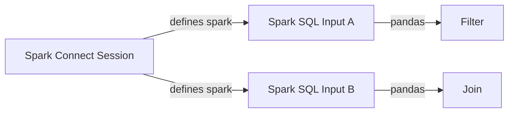

### 18.9 S12.1 Spark DataFrame type model (architecture)

**Decision (recommended):** introduce a **new component type family** rather than overloading `pandas_df_input`.

| Option | Pros | Cons | Verdict |
|---|---|---|---|
| A. Flag on Spark SQL Input (`keepSparkDf`) while type stays `pandas_df_input` | Small code change | Lies to CodeGenerator/handles; downstream pandas nodes break silently | Reject |
| B. New type `spark_df_input` (+ later `spark_df_processor` / `spark_df_output`) | Honest lineage; can gate connections in `isValidConnection` | Needs renderer handles, CodeGenerator cases, metadata panel | **Accept** |
| C. Dual-output node (pandas + spark handles) | Flexible | Complex UX; rare in Amphi | Defer |

**v2.1 path:** keep v1 Spark SQL Input as pandas-only. Add optional sibling **Spark SQL (native)** with `_type = 'spark_df_input'` that skips `toPandas()`. Until Spark processors exist, only Console-like inspection / toPandas bridge nodes should accept `spark_df_*`.

**S12.2 note:** do not add skip-toPandas on the current pandas component; implement as separate component or explicit “Collect to pandas” bridge.

### 18.10 S13.1 vendor Connect URL research

| Vendor | URL / env pattern | Auth | Amphi mapping |
|---|---|---|---|
| OSS Spark Connect | `sc://host:15002` | none / token / user_id | Current Generic |
| Databricks Connect (string) | `sc://{workspace}:443/;token={PAT};x-databricks-cluster-id={id}` | PAT only for Connect string | Preset **Databricks**: cluster id field + token; also honor `SPARK_REMOTE` |
| Databricks SDK style | `DatabricksSession.builder.remote(host=..., cluster_id=..., token=...)` | PAT / OAuth | Out of scope for v1 Connect string path; optional later |

References: [Databricks Connect advanced](https://docs.databricks.com/aws/en/dev-tools/databricks-connect/advanced), [Spark Connect connection string](https://github.com/apache/spark/blob/master/sql/connect/docs/client-connection-string.md).

**Env aliases for S13:** prefer `SPARK_CONNECT_URL`, fall back to `SPARK_REMOTE`; cluster via `DATABRICKS_CLUSTER_ID`.

### 18.11 References

- Apache Spark Connect documentation (Spark 3.5+).
- Amphi: `BaseCoreComponent`, `PostgresInput`, `MySQLInput`, `DatabaseInput`, `Connection`, `EnvFile`, `CodeGenerator.tsx`.
- `BUILDING.md`, `examples/README.md`, `examples/spark-sql-input.md`.
- [spark-sql-input-stories.md](./spark-sql-input-stories.md).

---

## 19. Document revision notes

Review performed 2026-08-04. Changes vs prior draft:

| Area | Optimization |
|---|---|
| Diagrams | Replaced ASCII boxes with Mermaid (overview, Connect vs local, lifecycle, sequence, layers, form visibility, credentials, codegen, registration, roadmap timeline, story deps, decision mindmap) |
| Decisions | Collapsed long §5 prose into a single decision table + mindmap; removed duplicated “decision log” appendix |
| Max rows | Clarified v1 UI requires **≥ 1** (no unlimited); default 10000 |
| Auth | Token + userpass via Connect URL params; env-first (`SPARK_*`) |
| Catalog | S10 Retrieve via SHOW CATALOGS / NAMESPACES / TABLES (implemented) |
| Shared session | S11 SparkConnectSession + CodeGenerator `spark_session` hooks |
| Spark DF | S12.1: prefer new `spark_df_*` types (not pandas flag) |
| Vendors | S13.1 Databricks Connect string research |
| TOC | Added revision notes; renamed checklist section |
| Cross-links | Stronger pointers to stories tracker and story dependency graph |
| Entities | Removed HTML `&gt;` in favor of plain `>` / markdown emphasis |
| Sample code | Kept one appendix sample; §10 remains the normative skeleton |

**Suggested follow-ups (optional, not blocking design):**

1. Token auth uses Connect URL `/;token=` (verified in codegen); keep watching PySpark for alternate `.config` keys.
2. Live Connect QA matrix + UI drag smoke when a cluster URL is available (`examples/spark-connect-smoke.py`).
3. Keep stories checkboxes and this design in sync when scope changes.
4. Deferred: full Kerberos / Databricks OAuth **wizards** (auth modes exist as deferred UI + codegen errors; see S27).
